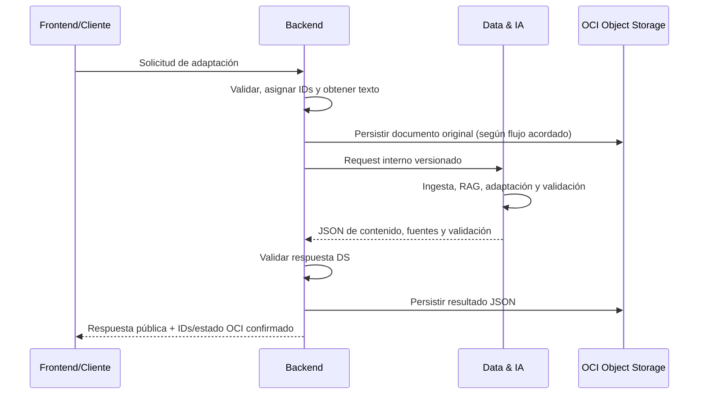

# Contrato de integración: Data Science ↔ Back-End

**Proyecto:** TechMind / NuevaMente — G10 LATAM, Equipo 15  
**Estado:** Propuesta de contrato para revisión de Data & IA y Backend  
**Versión del borrador:** 0.2  
**Fecha:** 2026-09-25

> Este documento consolida una propuesta integrable a partir de `TECHMIND_DOCUMENTO_BASE_CONTEXTO_Y_ALCANCE.md` y `Simulacion.pdf`. No representa una aprobación del equipo. Los campos o parámetros marcados como pendientes deben acordarse antes de tratar esta especificación como definitiva.

## 1. Objetivo y alcance

Definir la frontera de integración entre Data & IA (DS) y Back-End (BE) para solicitar la adaptación educativa de un documento y devolver contenido JSON trazable y validado.

El MVP considerado por el documento base contempla estos perfiles y formatos:

| Dimensión | Valores del MVP documentados |
|---|---|
| Perfil | `JUNIOR`, `SENIOR`, `EJECUTIVO` |
| Formato | `FLASHCARD`, `QUIZ`, `EXECUTIVE_SUMMARY`, `MIND_MAP` |

La simulación enumera opciones adicionales (por ejemplo, Tutorial y Guion de Clase/Video). No se incluyen como formatos disponibles en este borrador porque el alcance actualizado del MVP enumera cuatro formatos distintos. Cualquier ampliación requiere validación del equipo.

## 2. Límites y responsabilidades

### Data & IA

- Procesar el texto del documento: ingesta, chunking, embeddings y recuperación RAG.
- Construir/reutilizar la representación de conocimiento definida por el diseño de Data y adaptar el contenido al perfil y formato solicitados.
- Devolver contenido conforme al esquema correspondiente, junto con referencias a fuentes y estado de validación.
- Devolver errores estructurados cuando no pueda procesar o validar la solicitud.
- Mantener desacoplada la interfaz de tecnologías internas (modelo, vector store, framework u orquestador).
- No persistir directamente en OCI como parte de este contrato. La persistencia del documento original y del resultado es responsabilidad de BE/infraestructura.

### Back-End

- Exponer y versionar la API pública; validar la solicitud, autenticación/controles de seguridad y límites configurados.
- Asignar y correlacionar `request_id` y `document_id` (o aceptar IDs previamente asignados según decisión de BE).
- Obtener el texto del documento o coordinar su extracción antes de invocar DS. La propiedad de extracción de PDF/Markdown debe confirmarse entre equipos.
- Invocar DS, validar su respuesta, traducir errores al contrato público y controlar timeout/reintentos.
- Persistir originales y paquetes JSON en OCI Object Storage dentro de Always Free, y reportar únicamente el resultado real de esa operación.
- Evitar exponer secretos, trazas internas o contenido sensible innecesario.

### Compartido

- Acordar y versionar esquemas, enums, límites, timeouts y compatibilidad.
- Correlacionar logs por `request_id` sin registrar credenciales.
- Validar de extremo a extremo que las fuentes citadas correspondan al documento procesado.

## 3. API pública propuesta (Cliente/Frontend ↔ BE)

El documento base propone `POST /api/v1/adaptacion/generar`. Se conserva aquí como ruta propuesta, pendiente de confirmación por Backend. Esta ruta recibe JSON con texto ya disponible. La carga binaria/multipart y la referencia a documentos almacenados quedan fuera de esta forma mínima y requieren un acuerdo adicional.

### Solicitud

```json
{
  "documento_titulo": "Introducción a Redes VCN en OCI",
  "documento_contenido": "Texto del documento o extracto procesable...",
  "perfil_destinatario": "JUNIOR",
  "formato_salida": "FLASHCARD",
  "nicho_sector": "General",
  "nivel_detalle": "Didactico"
}
```

Reglas propuestas:

- `documento_titulo`, `documento_contenido`, `perfil_destinatario`, `formato_salida` y `nicho_sector` son requeridos.
- `nivel_detalle` aparece en el ejemplo de entrada de la fuente; su obligatoriedad y enum están pendientes de confirmar.
- Para el MVP, `perfil_destinatario` y `formato_salida` deben restringirse a los valores de la tabla de alcance. La representación final de enums (mayúsculas, espacios o etiquetas de UI) debe acordarse y fijarse en el esquema.
- `nicho_sector` y sus valores permitidos no están definidos en el documento base actualizado; la simulación da ejemplos. Backend y Data deben cerrar si será texto libre o enum.
- La solicitud no incluye el archivo binario en este esquema. La ruta de carga y el límite de caracteres/tamaño son pendientes.
- Rechazar campos mal tipados, contenido vacío o valores no soportados mediante error estructurado. El código HTTP exacto se debe acordar con Backend.

### Respuesta pública satisfactoria (BE → Cliente)

La respuesta combina la salida de DS con metadatos de Backend y, si la persistencia ocurre, los identificadores de OCI. Los nombres `exito` y `error` siguen el ejemplo de la simulación; confirmar si se mantendrá esa convención.

```json
{
  "status": "exito",
  "request_id": "req-001",
  "document_id": "doc-001",
  "contract_version": "0.2-draft",
  "metadatos": {
    "perfil_aplicado": "JUNIOR",
    "formato_generado": "FLASHCARD",
    "nicho_sector": "General",
    "nivel_detalle": "Didactico",
    "tiempo_estimado_estudio_minutos": 5,
    "conceptos_clave": ["VCN", "Subredes"],
    "prerrequisitos": []
  },
  "contenido_adaptado": {
    "type": "flashcard",
    "title": "Introducción a Redes VCN",
    "items": [
      {
        "id": "item-001",
        "question": "¿Qué es una VCN?",
        "answer": "...",
        "explanation": "...",
        "difficulty": "basic",
        "source_ids": ["src-001"]
      }
    ]
  },
  "fuentes": [
    {
      "source_id": "src-001",
      "document_id": "doc-001",
      "chunk_id": "chunk-003",
      "page": null
    }
  ],
  "evaluacion_calidad": {
    "status": "approved",
    "observaciones": []
  },
  "almacenamiento_oci": {
    "objeto_original_id": "originales/doc-001/documento",
    "objeto_resultado_id": "resultados/req-001/contenido.json",
    "status_upload": "completado"
  }
}
```

Reglas propuestas:

- `request_id`, `document_id` y `contract_version` deben ser estables durante el flujo; el responsable de asignar cada ID (BE o cliente) está pendiente.
- El ejemplo de salida de la simulación incluye `anclaje_fuente_score: 0.98`. Este contrato no devuelve un número por defecto: el campo solo debe añadirse si Data define y calcula una métrica reproducible, documenta su escala y acuerda su interpretación. No se debe simular precisión.
- `fuentes` debe identificar los fragmentos que respaldan el contenido. `page` puede ser `null` cuando la fuente no tenga paginación o el dato no esté disponible.
- Backend devuelve `almacenamiento_oci` solo después de confirmar la persistencia. Los nombres de bucket no se fijan aquí; dependen de la configuración real de OCI. Si la persistencia obligatoria falla, no reportar éxito completo.
- No devolver contenido vacío como éxito. El estado de validación que permita una respuesta utilizable y la política de resultado parcial están pendientes de definición por Data y BE.

## 4. Esquemas de `contenido_adaptado`

El envoltorio de respuesta se mantiene estable; `type` debe corresponder a `formato_salida`. Las estructuras siguientes son una base propuesta derivada del documento de alcance, no esquemas aprobados.

### Flashcards (`FLASHCARD`)

```json
{
  "type": "flashcard",
  "title": "...",
  "items": [
    {
      "id": "item-001",
      "question": "...",
      "answer": "...",
      "explanation": "...",
      "difficulty": "basic",
      "source_ids": ["src-001"]
    }
  ]
}
```

### Quiz (`QUIZ`)

```json
{
  "type": "quiz",
  "title": "...",
  "items": [
    {
      "id": "item-001",
      "question": "...",
      "options": [
        {"id": "A", "text": "..."},
        {"id": "B", "text": "..."}
      ],
      "correct_answer_id": "A",
      "explanation": "...",
      "source_ids": ["src-001"]
    }
  ]
}
```

### Resumen ejecutivo (`EXECUTIVE_SUMMARY`)

```json
{
  "type": "executive_summary",
  "title": "...",
  "summary": "...",
  "key_points": ["..."],
  "source_ids": ["src-001"]
}
```

### Mapa mental (`MIND_MAP`)

```json
{
  "type": "mind_map",
  "title": "...",
  "nodes": [
    {"id": "node-001", "label": "...", "source_ids": ["src-001"]}
  ],
  "edges": [
    {"source": "node-001", "target": "node-002", "label": "..."}
  ]
}
```

Los campos obligatorios, cardinalidades, vocabularios de `difficulty` y reglas de relaciones/nodos deben definirse en el esquema validado de Data. Cada `source_id` utilizado en el contenido debe existir en `fuentes`.

## 5. Contrato interno propuesto (BE → DS)

La interfaz interna recibe texto normalizado. Así el contrato no fuerza a Data a conocer rutas privadas de BE ni el detalle de OCI.

```json
{
  "contract_version": "0.2-draft",
  "request_id": "req-001",
  "document": {
    "document_id": "doc-001",
    "title": "Introducción a Redes VCN en OCI",
    "text": "Texto extraído y normalizado...",
    "source": {
      "media_type": "text/plain",
      "filename": null
    }
  },
  "parameters": {
    "profile": "JUNIOR",
    "format": "FLASHCARD",
    "industry_context": "General",
    "detail_level": "Didactico"
  }
}
```

`source.media_type`, `filename`, `industry_context` y `detail_level` son propuestas de representación; deben mapearse desde el request público una vez que BE y Data acuerden enums y soporte de archivos. No se transmite una URI de almacenamiento en esta versión interna.

## 6. Contrato interno propuesto (DS → BE)

```json
{
  "contract_version": "0.2-draft",
  "request_id": "req-001",
  "document_id": "doc-001",
  "profile": "JUNIOR",
  "format": "FLASHCARD",
  "status": "success",
  "metadata": {
    "study_time_minutes": 5,
    "key_concepts": ["VCN", "Subredes"],
    "prerequisites": []
  },
  "content": {
    "type": "flashcard",
    "title": "Introducción a Redes VCN",
    "items": []
  },
  "sources": [
    {
      "source_id": "src-001",
      "document_id": "doc-001",
      "chunk_id": "chunk-003",
      "page": null
    }
  ],
  "validation": {
    "status": "approved",
    "observations": []
  },
  "pipeline_version": "implementation-defined"
}
```

`pipeline_version` debe reflejar una versión/configuración real disponible en Data; su formato exacto está pendiente. DS no devuelve campos OCI. Los valores de ejemplo no constituyen resultados medidos.

## 7. Validación, errores y estados

### Validación de Data

El documento base requiere validar fidelidad al contexto recuperado, esquema/formato, adaptación al perfil, existencia de fuentes y completitud. Propone los estados `APPROVED`, `REQUIRES_ADJUSTMENT` y `REJECTED`; los criterios, el número de reintentos y la condición de éxito utilizable son responsabilidad de Data y siguen pendientes.

### Error interno y público

Forma interna sugerida:

```json
{
  "contract_version": "0.2-draft",
  "request_id": "req-001",
  "status": "error",
  "error": {
    "code": "INSUFFICIENT_CONTEXT",
    "message": "No se encontró contexto suficiente para generar el contenido.",
    "retryable": false
  }
}
```

Forma pública sugerida:

```json
{
  "status": "error",
  "request_id": "req-001",
  "error": {
    "code": "INSUFFICIENT_CONTEXT",
    "message": "No hay información suficiente en el documento para generar el formato solicitado."
  }
}
```

Categorías mínimas documentadas: solicitud inválida, formato/perfil no soportado, documento no procesable, contenido o contexto insuficiente, error de generación, límite excedido, servicio no disponible, validación rechazada y fallo de almacenamiento. La lista final de códigos, HTTP status y clasificación de reintentable debe aprobarla Backend junto con Data. Los mensajes públicos no deben revelar información interna.

## 8. Flujo de integración



La secuencia exacta de persistencia del original, tratamiento de fallos parciales y recuperación de documentos debe acordarse con Backend/OCI. El requisito confirmado de la simulación es almacenar original y resultado en OCI Object Storage Always Free.

## 9. Progreso y procesamiento asíncrono

El documento base menciona `GET /api/v1/adaptacion/stream` y SSE o WebSocket como alternativas aún por coordinar. Este borrador no fija mecanismo ni ruta. Si se habilita progreso, las fases neutrales propuestas son `EXTRACTION`, `RETRIEVAL`, `GENERATION`, `VALIDATION` y `COMPLETED`; Backend y Frontend deben acordar transporte, payload, correlación y tratamiento de desconexiones.

## 10. Seguridad y límites operativos

- Mantener credenciales y configuración sensible fuera del contrato y del código fuente.
- Aplicar controles de entrada y salida (incluida protección ante contenido malicioso/prompt injection) conforme a la implementación acordada.
- No registrar secretos ni contenido sensible innecesario.
- Definir antes de integrar: tamaño máximo de documento, límites de texto y salida, timeout, concurrencia, `top_k`, presupuesto de contexto/tokens y reintentos. El documento base indica que los valores deben derivarse de pruebas de Data; por ello no se inventan valores aquí.
- Usar exclusivamente OCI Object Storage de la capa Always Free para la persistencia obligatoria del MVP, según la simulación. El nombre de bucket y la configuración concreta no están confirmados en las fuentes disponibles.

## 11. Criterios de aceptación propuestos

- Solicitud y respuesta JSON parseables que cumplen un esquema versionado en ambos límites.
- Los perfiles y formatos soportados coinciden con la tabla de alcance vigente.
- El contenido de salida incluye referencias trazables a chunks/fuentes y cada referencia usada resuelve a una fuente de la respuesta.
- La respuesta incluye conceptos clave, prerrequisitos cuando se identifiquen y tiempo estimado de estudio.
- Una solicitud inválida, contenido insuficiente, fallo de generación, validación rechazada o error de OCI produce estado/código acordado y no se presenta como éxito completo.
- Backend confirma persistencia del original y del resultado en OCI Object Storage Always Free antes de reportar esos objetos como cargados.
- El MVP demuestra adaptación del mismo documento para al menos dos perfiles distintos y dos formatos distintos; la simulación solicita además tres escenarios de demostración.

## 12. Decisiones pendientes para cerrar el contrato

| Tema | Pendiente | Responsable de validación |
|---|---|---|
| Fuente técnica | `CONTRATOS_BACKEND_API.md` es referenciado por el documento base, pero no está disponible en los archivos revisados | Backend |
| API pública | Confirmar ruta, método, autenticación y propietario de IDs | Backend |
| Ingesta | Confirmar carga directa de PDF/Markdown/texto, extracción y paso de texto a DS | Backend + Data |
| Esquema | Aprobar nombres, obligatoriedad, tipos, enums y esquemas por formato | Backend + Data |
| Nicho/detalle | Definir valores permitidos y si son enums o texto | Backend + Data |
| Estados | Definir estados de éxito parcial, validación y error | Data + Backend |
| Score de anclaje | Definir si existe métrica reproducible, escala y umbral; no devolver ejemplo como medición real | Data |
| Límites | Fijar tamaño, timeout, concurrencia, salida y reintentos tras pruebas | Data + Backend |
| Persistencia OCI | Definir bucket/configuración, momento de carga y política ante fallo parcial | Backend + OCI |
| Progreso | Decidir si habrá SSE/WebSocket, payload y fases | Backend + Frontend + Data |
| Versionado | Definir política de compatibilidad y cambios incompatibles | Backend + Data |

## 13. Fuentes y trazabilidad

- `TECHMIND_DOCUMENTO_BASE_CONTEXTO_Y_ALCANCE.md` (versión 0.1, 2026-09-25): alcance actualizado del MVP, arquitectura, responsabilidades y contrato propuesto.
- `Simulacion.pdf` (Hackathon ONE G10): necesidad, formatos de entrada, persistencia obligatoria en OCI Always Free y ejemplo de request/response.
- `CONTRATOS_BACKEND_API.md`: citado por el documento base, pero no localizado en `Proyecto/NUEVAMENTE`; no se usó para fijar requisitos.

**Resultado:** borrador listo para revisión conjunta. No se ha validado con los equipos ni contra una implementación; no debe tratarse como contrato aprobado.
