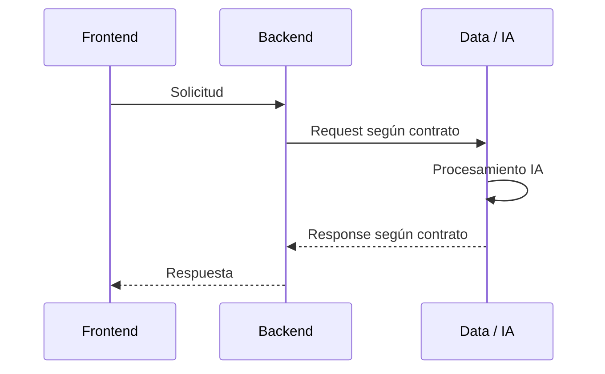

# CONTRATO DE INTEGRACIÓN DATA/IA ↔ BACKEND — V1.1

## NuevaMente — G10 LATAM Equipo 15

**Estado:** Propuesta para cierre y aprobación  
**Objetivo:** permitir que Backend y Data/IA trabajen en paralelo con una frontera de integración clara, simple y estable.

---

# 🔴 1. Objetivo del contrato 

Este documento define de forma clara:

- qué recibe Data/IA desde Backend;
- qué devuelve Data/IA a Backend;
- qué estructura debe respetar cada intercambio;
- qué responsabilidad tiene cada equipo;
- qué decisiones todavía deben cerrarse.

La regla principal es:

> **Backend y Data/IA trabajan de forma independiente mientras respeten este contrato.**

Backend no necesita conocer la implementación interna de Data/IA y Data/IA no necesita conocer la implementación interna de Backend.

---

# 🔴 2. Alcance del MVP — YA DEFINIDO

## 2.1 Perfiles

El MVP tiene **3 perfiles**:

| Código | Perfil | Objetivo |
|---|---|---|
| `JUNIOR` | Junior | Explicación clara, accesible y orientada a fundamentos |
| `SENIOR` | Senior | Mayor profundidad técnica y relaciones entre conceptos |
| `EJECUTIVO` | Ejecutivo | Síntesis de alto nivel y puntos relevantes para decisión |

**Estos 3 perfiles forman parte del alcance aprobado del MVP.**

No se abre una decisión sobre perfiles en este contrato.

---

## 2.2 Formatos

El MVP tiene **4 formatos**:

| Código | Formato | Descripción |
|---|---|---|
| `FLASHCARD` | Flashcard | Tarjetas de pregunta/respuesta |
| `QUIZ` | Quiz | Preguntas con opciones y respuesta correcta |
| `EXECUTIVE_SUMMARY` | Resumen Ejecutivo | Síntesis de los puntos principales |
| `MIND_MAP` | Mapa Mental | Estructura jerárquica de conceptos y relaciones |

### Fuera del MVP

```text
STEP_BY_STEP
```

Guía Paso a Paso queda para una versión posterior.

**Estos 4 formatos forman parte del alcance del MVP.**

No se abre una decisión sobre formatos en este contrato.

---

# 3. Principio de independencia entre equipos

## Backend necesita conocer

```text
Request
    ↓
Contrato DS ↔ BE
    ↓
Response
```

## Backend NO necesita conocer

```text
Embeddings
Vector Store
Chunks
Similarity
Prompts
Modelo LLM
RAG interno
Knowledge Core interno
Framework de orquestación
```

Data/IA puede cambiar estos componentes internamente sin romper el contrato.

---

# 4. Flujo de integración



El contrato definido aquí corresponde principalmente a:

```text
BE → DS
DS → BE
```

---

# 🔴 5. Contrato BE → DS

Backend enviará a Data/IA una solicitud con esta estructura:

```json
{
  "contract_version": "1.0",
  "request_id": "req_123",
  "document": {
    "document_id": "doc_456",
    "title": "Introducción a Redes en OCI",
    "text": "Texto normalizado del documento..."
  },
  "profile": "JUNIOR",
  "format": "FLASHCARD"
}
```

---

# 🔴 6. Campos del Request

| Campo | Tipo | Obligatorio | Descripción |
|---|---|---:|---|
| `contract_version` | string | Sí | Versión del contrato |
| `request_id` | string | Sí | Identificador único de la solicitud |
| `document.document_id` | string | Sí | Identificador del documento |
| `document.title` | string | Sí | Título del documento |
| `document.text` | string | Sí | Texto normalizado que procesará DS |
| `profile` | enum | Sí | `JUNIOR`, `SENIOR`, `EJECUTIVO` |
| `format` | enum | Sí | `FLASHCARD`, `QUIZ`, `EXECUTIVE_SUMMARY`, `MIND_MAP` |

---

# 🔴 7. Documento de entrada

El contrato trabaja con **texto normalizado**, no con un formato de archivo específico.

Ejemplo:

```json
{
  "document": {
    "document_id": "doc_456",
    "title": "Manual de Docker",
    "text": "Docker es una plataforma..."
  }
}
```

Esto permite que el documento original sea PDF, DOCX, Markdown, TXT, etc., sin hacer que Data/IA dependa del formato del archivo.

## Decisión pendiente

Debe definirse quién realiza:

1. recepción del archivo;
2. extracción del contenido;
3. normalización del texto;
4. construcción de `document.text`.

### Pregunta puntual para BE

**¿Backend será responsable de entregar a DS el texto ya extraído y normalizado?**

- [ ] Sí
- [ ] No → definir responsable

> Esta es una decisión de integración porque determina exactamente qué recibe DS.

---

# 8. Perfiles

El perfil se envía como parámetro:

```json
"profile": "SENIOR"
```

Data/IA define internamente cómo adaptar el contenido.

Backend no necesita conocer prompts ni reglas internas.

## Reglas funcionales

### `JUNIOR`

- explicación técnica accesible;
- conceptos fundamentales;
- ejemplos prácticos;
- complejidad adecuada para un desarrollador junior.

### `SENIOR`

- mayor profundidad técnica;
- relaciones entre conceptos;
- consideraciones de arquitectura;
- detalles relevantes para implementación.

### `EJECUTIVO`

- síntesis;
- puntos clave;
- impacto;
- consideraciones relevantes para decisión.

---

# 9. Formatos

## 9.1 `FLASHCARD`

Ejemplo:

```json
{
  "format": "FLASHCARD",
  "content": {
    "items": [
      {
        "question": "¿Qué es una VCN?",
        "answer": "Es una red virtual privada dentro de OCI.",
        "source_ids": ["src_001"]
      }
    ]
  }
}
```

---

## 9.2 `QUIZ`

Ejemplo:

```json
{
  "format": "QUIZ",
  "content": {
    "items": [
      {
        "question": "¿Qué función cumple una VCN?",
        "options": [
          "Gestionar usuarios",
          "Crear una red virtual",
          "Almacenar archivos",
          "Ejecutar consultas SQL"
        ],
        "correct_option": 1,
        "explanation": "Una VCN permite crear una red virtual..."
      }
    ]
  }
}
```

---

## 9.3 `EXECUTIVE_SUMMARY`

Ejemplo:

```json
{
  "format": "EXECUTIVE_SUMMARY",
  "content": {
    "title": "Resumen ejecutivo",
    "overview": "Síntesis del contenido...",
    "key_points": [
      "Punto principal 1",
      "Punto principal 2"
    ],
    "considerations": [
      "Consideración relevante"
    ]
  }
}
```

---

## 9.4 `MIND_MAP`

Ejemplo:

```json
{
  "format": "MIND_MAP",
  "content": {
    "central_topic": "Redes en OCI",
    "branches": [
      {
        "name": "VCN",
        "children": [
          "Subredes",
          "Routing",
          "Security Lists"
        ]
      }
    ]
  }
}
```

---

# 🔴 10. Estructura común de `content`

Todos los formatos utilizan:

```json
"content": {}
```

La estructura interna depende del `format`.

Data/IA es responsable de generar el contenido correspondiente al formato solicitado.

Backend valida que la respuesta cumpla el schema acordado.

## Decisión pendiente

Para que Backend pueda avanzar sin depender de la implementación de DS:

**¿Se aprobarán desde ahora los JSON Schemas definitivos de los 4 formatos?**

- [ ] Sí → DS entrega/define los 4 schemas.
- [ ] No → definir una estructura mínima temporal y fecha para cerrar los schemas.

> **Recomendación:** cerrar los 4 schemas como parte de V1.0. Así BE puede desarrollar DTOs, validaciones y mocks sin esperar al pipeline de IA.

---

# 11. Contrato DS → BE

La respuesta tiene una estructura común para los 4 formatos:

```json
{
  "contract_version": "1.0",
  "request_id": "req_123",
  "document_id": "doc_456",
  "profile": "JUNIOR",
  "format": "FLASHCARD",
  "status": "APPROVED",
  "content": {},
  "sources": [],
  "validation": {}
}
```

---

# 12. Campos de Response

| Campo | Tipo | Obligatorio | Descripción |
|---|---|---:|---|
| `contract_version` | string | Sí | Versión del contrato |
| `request_id` | string | Sí | Identificador de la solicitud |
| `document_id` | string | Sí | Documento procesado |
| `profile` | enum | Sí | Perfil utilizado |
| `format` | enum | Sí | Formato generado |
| `status` | enum | Sí | Estado del procesamiento |
| `content` | object | Cuando existe resultado | Contenido generado |
| `sources` | array | Sí | Fuentes utilizadas |
| `validation` | object | Sí | Resultado de validación |

---

# 13. Estados

Se utilizarán tres estados funcionales:

| Estado | Significado |
|---|---|
| `APPROVED` | Resultado válido y listo para utilizar |
| `REQUIRES_ADJUSTMENT` | El resultado requiere ajuste o reintento |
| `REJECTED` | No existe un resultado válido para entregar |

Ejemplo exitoso:

```json
{
  "status": "APPROVED"
}
```

Ejemplo de resultado rechazado:

```json
{
  "status": "REJECTED",
  "content": null,
  "validation": {
    "reason": "INSUFFICIENT_CONTEXT"
  }
}
```

## Decisión pendiente

**Confirmar que estos tres estados son suficientes para el MVP.**

- [ ] Aprobado
- [ ] Requiere cambio

---

# 14. Fuentes y trazabilidad

Data/IA debe informar las fuentes utilizadas para construir el contenido.

Estructura propuesta:

```json
"sources": [
  {
    "source_id": "src_001",
    "document_id": "doc_456",
    "reference": "manual.pdf - Introducción - página 12",
    "page": 12,
    "section": "Introducción"
  }
]
```

## Campos

| Campo | Obligatorio | Descripción |
|---|---:|---|
| `source_id` | Sí | Identificador de la fuente |
| `document_id` | Sí | Documento de origen |
| `reference` | Sí | Referencia legible |
| `page` | No | Página cuando exista |
| `section` | No | Sección cuando pueda identificarse |

Ejemplo sin página:

```json
{
  "source_id": "src_002",
  "document_id": "doc_789",
  "reference": "README.md - Instalación",
  "section": "Instalación"
}
```

## Información interna de DS

No forma parte del contrato público:

```text
chunk_id
similarity
retrieval_rank
embedding_id
vector_store_id
```

### Decisión pendiente

**¿Esta información de `sources` es suficiente para que Frontend pueda mostrar la trazabilidad al usuario?**

- [ ] Sí
- [ ] No → indicar información adicional

---

# 15. Validación

Data/IA valida el resultado antes de devolverlo.

La validación debe considerar como mínimo:

- estructura del contenido;
- perfil solicitado;
- formato solicitado;
- consistencia con el contexto recuperado;
- trazabilidad mediante fuentes.

Ejemplo:

```json
"validation": {
  "status": "APPROVED",
  "quality_score": 0.95,
  "observations": "Contenido validado correctamente."
}
```

## Decisión pendiente

Definir los campos mínimos de `validation`.

Propuesta:

```text
status
quality_score
observations
```

### Importante

El valor:

```text
quality_score >= 0.85
```

no forma parte todavía de una regla aprobada.

---

# 16. Contexto insuficiente

Data/IA no debe inventar información cuando el contexto disponible no sea suficiente.

Ejemplo:

```json
{
  "status": "REJECTED",
  "content": null,
  "sources": [],
  "validation": {
    "status": "REJECTED",
    "reason": "INSUFFICIENT_CONTEXT",
    "observations": "No existe suficiente información en las fuentes recuperadas."
  }
}
```

## Decisión pendiente

Cuando el contexto sea insuficiente:

- [ ] `REJECTED`
- [ ] `REQUIRES_ADJUSTMENT`

---

# 17. Errores técnicos

Los errores técnicos se diferencian de los estados funcionales de generación.

Ejemplo:

```json
{
  "contract_version": "1.0",
  "request_id": "req_123",
  "status": "ERROR",
  "error": {
    "code": "INVALID_REQUEST",
    "message": "La solicitud no cumple el contrato."
  }
}
```

## Catálogo inicial propuesto

| Código | Descripción |
|---|---|
| `INVALID_REQUEST` | Request inválido |
| `INVALID_PROFILE` | Perfil no soportado |
| `INVALID_FORMAT` | Formato no soportado |
| `DOCUMENT_INVALID` | Documento inválido |
| `DOCUMENT_TOO_LARGE` | Documento excede el límite |
| `INSUFFICIENT_CONTEXT` | Contexto insuficiente |
| `PROCESSING_TIMEOUT` | Tiempo de procesamiento excedido |
| `INTERNAL_ERROR` | Error interno |
| `SERVICE_UNAVAILABLE` | Servicio temporalmente no disponible |

## Decisión pendiente

**BE + DS deben aprobar este catálogo inicial o indicar modificaciones.**

---

# 18. Responsabilidad sobre errores

## Backend

Responsable de:

- validar request;
- traducir errores a HTTP status;
- controlar timeout;
- controlar retries de integración;
- exponer mensajes adecuados al cliente.

## Data/IA

Responsable de:

- errores del pipeline IA;
- validación del contenido;
- contexto insuficiente;
- errores internos del procesamiento;
- informar códigos definidos en este contrato.

---

# 19. Timeout y retries

Se separan dos niveles.

## Retry de integración

Responsabilidad de Backend.

```text
BE → DS
     ↓ timeout
BE → retry
```

## Retry interno de IA

Responsabilidad de Data/IA.

Puede corresponder a:

- generación;
- validación;
- proveedor LLM;
- recuperación ante fallos internos.

## Decisión pendiente

Definir:

```text
BE timeout: ______
BE retries: ______
DS retries: ______
```

---

# 20. Idempotencia

`request_id` identifica una solicitud:

```json
"request_id": "req_123"
```

## Decisión pendiente

Definir si `request_id` será también la clave de idempotencia.

- [ ] Sí
- [ ] No → utilizar `idempotency_key`

---

# 21. Versionado

La versión del contrato se identifica mediante:

```json
"contract_version": "1.0"
```

Un cambio incompatible en Request o Response requiere una nueva versión del contrato.

La versión interna del pipeline de Data/IA es independiente y no debe ser una dependencia de Backend.

---

# 22. Límites del MVP

Deben definirse como mínimo:

## Entrada

```text
Tamaño máximo del documento: ______
Longitud máxima de texto: ______
```

## Procesamiento

```text
Timeout: ______
Retries: ______
```

## Salida

```text
Cantidad máxima de items: ______
Tamaño máximo de respuesta: ______
```

## Responsabilidad

| Límite | Responsable |
|---|---|
| Request/API | BE |
| Procesamiento IA | DS |
| RAG/contexto | DS |
| Response/API | BE |

---

# 23. Seguridad

## Backend

Responsable de:

- autenticación;
- autorización;
- validación de entrada;
- rate limiting;
- límites de API.

## Data/IA

Responsable de:

- protección del pipeline;
- no exponer prompts internos;
- no exponer credenciales;
- no exponer información interna innecesaria.

---

# 24. OCI

La persistencia de resultados en OCI corresponde a Backend.

Flujo:

```text
DS
 ↓
Response
 ↓
BE
 ↓
OCI Object Storage
```

Data/IA no necesita escribir directamente en OCI para cumplir este contrato.

## Decisión pendiente

Definir qué debe persistir Backend:

- [ ] Documento original
- [ ] Resultado generado
- [ ] Ambos
- [ ] Otro: __________

---

# 25. Streaming / progreso

Se había propuesto progreso mediante SSE/WebSocket.

Para permitir que Backend avance sin depender de esta funcionalidad, el contrato principal funciona de forma síncrona:

```text
BE → DS
     ↓
 procesamiento
     ↓
DS → BE
```

El streaming/progreso puede incorporarse posteriormente como una extensión del contrato.

## Decisión pendiente

**¿Streaming forma parte del MVP?**

- [ ] Sí
- [ ] No, queda para una versión posterior

> El contrato principal Request/Response no depende de esta decisión.

---

# 26. Knowledge Core

Data/IA puede utilizar internamente una representación común:

```json
{
  "topic": "...",
  "concepts": [],
  "definitions": [],
  "key_points": [],
  "relationships": [],
  "examples": [],
  "procedures": [],
  "comparisons": [],
  "questions_candidates": [],
  "sources": []
}
```

Esto permite generar los cuatro formatos a partir de un mismo contexto.

## Importante

**Knowledge Core NO forma parte del contrato público con Backend.**

Es una decisión interna de Data/IA.

---

# 27. RAG

Data/IA es responsable de:

1. preparar el contexto;
2. embeddings;
3. retrieval;
4. RAG;
5. construcción del Knowledge Core;
6. generación;
7. validación.

Backend no necesita conocer:

```text
top_k
similarity threshold
chunking
embeddings
vector store
prompt
LLM
```

Estos parámetros pueden cambiar internamente mientras el contrato se mantenga.

---

# 28. Responsabilidades

| Responsabilidad | BE | DS |
|---|:---:|:---:|
| API pública | ✓ | |
| Validación del Request | ✓ | |
| `request_id` | ✓ | |
| Extracción/normalización documento | **Pendiente** | **Pendiente** |
| RAG | | ✓ |
| Embeddings | | ✓ |
| Retrieval | | ✓ |
| Knowledge Core | | ✓ |
| Adaptación por perfil | | ✓ |
| Generación por formato | | ✓ |
| Validación IA | | ✓ |
| Response | Consume | ✓ |
| Sources | Consume | ✓ |
| Catálogo de errores | ✓ | ✓ |
| Timeout integración | ✓ | |
| Retry integración | ✓ | |
| Retry interno IA | | ✓ |
| Persistencia OCI | ✓ | |
| Prompts | | ✓ |
| LLM | | ✓ |
| Vector Store | | ✓ |

---

# 29. Lo que Backend puede comenzar a construir inmediatamente

Backend no necesita esperar a que Data/IA termine el pipeline.

Puede implementar:

## API

```text
POST /api/v1/adaptacion/generar
```

## DTOs

```text
AdaptacionRequest
AdaptacionResponse
```

## Enums

```text
Profile
Format
Status
```

## Validaciones

```text
Request validation
Profile validation
Format validation
Document limits
```

## Errores

```text
400
408 / 504
503
500
```

## Persistencia

```text
OCI Object Storage
```

## Mock de DS

BE puede desarrollar contra una respuesta simulada que respete este contrato.

---

# 30. Mock recomendado para Backend

Mientras Data/IA desarrolla el pipeline, Backend puede utilizar:

```json
{
  "contract_version": "1.0",
  "request_id": "req_mock_001",
  "document_id": "doc_001",
  "profile": "JUNIOR",
  "format": "FLASHCARD",
  "status": "APPROVED",
  "content": {
    "items": [
      {
        "question": "¿Qué es una VCN?",
        "answer": "Una red virtual privada en OCI.",
        "source_ids": ["src_001"]
      }
    ]
  },
  "sources": [
    {
      "source_id": "src_001",
      "document_id": "doc_001",
      "reference": "manual.pdf - página 12",
      "page": 12
    }
  ],
  "validation": {
    "status": "APPROVED",
    "quality_score": 0.95,
    "observations": "Contenido validado."
  }
}
```

Esto permite que Backend desarrolle y pruebe sin esperar al modelo real.

---

## 31. Decisiones pendientes — enfocadas en desbloquear Backend

| # | Decisión | Prioridad para BE | Dónde está definido en el contrato | ¿Bloquea BE? |
|---|---|---|---|---|
| 1 | Quién extrae y normaliza el documento | 🔴 Ahora | 11 — Endpoint principal / documento de entrada | **Sí** |
| 2 | JSON Schema definitivo de los 4 formatos | 🔴 Ahora | 9 — Contrato de contenido / formatos | **Sí** |
| 3 | Campos mínimos de `validation` | 🟡 Inicial | 12 — Respuesta BE → FE | No |
| 4 | Información definitiva de `sources` para FE | 🟢 Después | 12–13 — Respuesta / consumo FE | No |
| 5 | Estados `APPROVED / REQUIRES_ADJUSTMENT / REJECTED` | 🔴 Ahora | 14 — Ciclo de vida / estados | **Sí** |
| 6 | Catálogo definitivo de errores | 🔴 Ahora | 15 — Errores | **Sí** |
| 7 | Timeout | 🔴 Ahora, valor inicial | 16 — Timeout y reintentos | **Sí** |
| 8 | Retries | 🟡 Inicial | 16 — Timeout y reintentos | No |
| 9 | Idempotencia | 🟡 Después | 17 — Idempotencia | No |
| 10 | Límites de entrada/salida | 🔴 Ahora, valores iniciales | 20 — Seguridad y límites | **Sí** |
| 11 | Qué persiste BE en OCI | 🟢 Después | 18 — Persistencia OCI | No |
| 12 | Streaming dentro o fuera del MVP | 🟢 Después / fuera del MVP inicial | 19 — Progreso / Streaming | No |

### Ya definido y NO sujeto a discusión

```text
PERFILES:
JUNIOR
SENIOR
EJECUTIVO

FORMATOS:
FLASHCARD
QUIZ
EXECUTIVE_SUMMARY
MIND_MAP

STEP_BY_STEP:
FUERA DEL MVP
```

---

# 32. Definition of Done — Contrato DS ↔ BE

El contrato queda cerrado cuando:

- [x] 3 perfiles definidos.
- [x] 4 formatos definidos.
- [x] `STEP_BY_STEP` fuera del MVP.
- [ ] Request aprobado.
- [ ] Response aprobado.
- [ ] Schema de cada formato definido.
- [ ] Sources aprobado.
- [ ] Estados aprobados.
- [ ] Validation definido.
- [ ] Errores aprobados.
- [ ] Responsabilidad de extracción del documento definida.
- [ ] Timeout definido.
- [ ] Retries definidos.
- [ ] Idempotencia definida.
- [ ] Límites definidos.
- [ ] OCI definido.
- [ ] Streaming definido como MVP o futuro.
- [ ] `contract_version = 1.0` aprobado.

---

# 33. Regla final de integración

Una vez aprobado este contrato:

> **Backend puede avanzar utilizando el contrato y un Mock de Data/IA.**

> **Data/IA puede desarrollar y cambiar internamente su pipeline sin bloquear a Backend.**

> **Ningún equipo debe cambiar unilateralmente Request, Response, enums o schemas sin actualizar este contrato y comunicar el cambio al otro equipo.**

---

# 34. Aprobación

| Equipo | Responsable | Estado | Fecha |
|---|---|---|---|
| Data / IA | __________ | ☐ Aprobado | __________ |
| Backend | __________ | ☐ Aprobado | __________ |
| Frontend* | __________ | ☐ Validado | __________ |

\* Frontend participa únicamente en los puntos que afectan la presentación del contenido y la trazabilidad.

---

## Control de versión

**Contrato:** DS ↔ BE  
**Versión:** 1.1  
**Estado:** Pendiente de aprobación  
**Última actualización:** 2026-09-25
