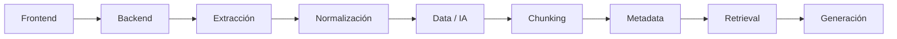
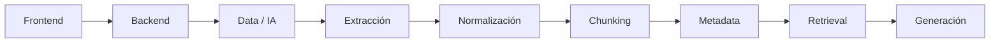
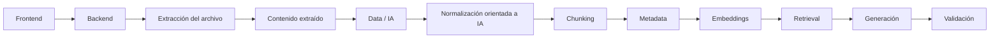
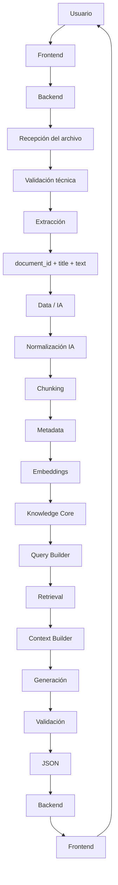

# GAP-01 — Extracción y Normalización

**Proyecto:** NuevaMente
**Equipo:** G10-LATAM-EQUIPO15
**Área:** Data / IA + Backend
**Tipo:** GAP de arquitectura e integración
**Estado:** 🟡 Decisión propuesta — Pendiente de aprobación
**Prioridad:** 🔴 Alta
**Relacionado con:** Contrato Backend ↔ Data/IA

---

## 1. Objetivo

Definir claramente las responsabilidades de **Backend** y **Data/IA** durante el procesamiento inicial de los documentos.

El objetivo es establecer:

* quién recibe el archivo;
* quién realiza la extracción del contenido;
* quién construye el contenido normalizado;
* qué información cruza la frontera Backend ↔ Data/IA;
* dónde comienza formalmente el pipeline de IA;
* qué aspectos quedan fuera de esta decisión.

Esta definición busca evitar duplicidad de responsabilidades y mantener estable el contrato de integración.

---

# 2. Situación actual

El contrato de integración definido para Data/IA no recibe directamente un archivo.

El objeto `document` contempla actualmente:

```json
{
  "document": {
    "document_id": "doc_456",
    "title": "Introducción a Redes en OCI",
    "text": "Texto normalizado del documento..."
  }
}
```

Por lo tanto, existe una frontera que debemos definir:

```text
Archivo físico
     │
     ▼
¿Quién lo procesa?
     │
     ▼
document.text
     │
     ▼
Pipeline Data / IA
```

Actualmente esta responsabilidad no estaba completamente cerrada.

---

# 3. Problema a resolver

Debemos diferenciar tres procesos:

```text
EXTRACCIÓN
    ↓
NORMALIZACIÓN
    ↓
CHUNKING
```

No son necesariamente la misma responsabilidad.

### 3.1 Extracción

Consiste en obtener el contenido desde el archivo original.

Ejemplo:

```text
documento.pdf
      ↓
texto extraído
```

Puede involucrar:

* lectura del archivo;
* extracción de texto;
* identificación de páginas;
* recuperación de títulos;
* listas;
* tablas;
* código;
* secciones.

---

### 3.2 Normalización

Consiste en preparar el contenido para que tenga una representación consistente y utilizable por el pipeline.

Ejemplo:

```text
Contenido extraído
        ↓
normalización
        ↓
contenido estructurado/consistente
```

La normalización puede conservar información útil como:

* títulos;
* subtítulos;
* listas;
* tablas;
* código;
* secciones;
* referencias de origen.

---

### 3.3 Chunking

El chunking ocurre posteriormente.

```text
Documento normalizado
        ↓
     Chunking
        ↓
 ┌──────┼──────┐
 ▼      ▼      ▼
C1     C2     C3
```

El chunking pertenece al pipeline de Data/IA.

---

# 4. Opciones consideradas

## Opción A — Backend realiza extracción y normalización



### Ventajas

* Data/IA recibe directamente el contrato actual.
* La frontera de integración es clara.
* El componente de IA no necesita conocer los formatos originales.
* Backend controla la recepción del archivo.

### Desventajas

* Backend debe manejar lógica relacionada con documentos.
* Puede requerir librerías específicas para diferentes formatos.
* La normalización orientada a IA podría quedar demasiado ligada a Backend.

---

# 5. Opción B — Data/IA recibe directamente el archivo



### Ventajas

* La lógica documental queda próxima al pipeline de IA.
* Data/IA controla completamente el procesamiento previo.

### Desventajas

* Modifica significativamente el contrato actual.
* Data/IA tendría que asumir responsabilidades de manejo de archivos.
* Aumenta el acoplamiento entre la entrada física y el pipeline IA.
* Puede dificultar la independencia entre Backend y Data/IA.

---

# 6. Opción C — Separar extracción y normalización

Esta opción establece una frontera más clara:



### Responsabilidad de Backend

Backend se ocupa del **archivo como entrada del sistema**.

### Responsabilidad de Data/IA

Data/IA se ocupa del **contenido como entrada del pipeline de conocimiento**.

Esta separación permite mantener una frontera más estable entre ambos equipos.

---

# 7. Decisión propuesta

> **DECISIÓN PROPUESTA — PENDIENTE DE APROBACIÓN**

Para el MVP se propone adoptar la **Opción C**.

La responsabilidad se dividiría de la siguiente manera:

| Actividad                              | Backend | Data/IA |
| -------------------------------------- | :-----: | :-----: |
| Recibir archivo                        |    ✅    |    ❌    |
| Validación técnica inicial             |    ✅    |    ❌    |
| Identificar formato                    |    ✅    |    ❌    |
| Extracción del contenido               |    ✅    |    ❌    |
| Construcción de `document.text`        |    ✅    |    ❌    |
| Preservar estructura disponible        |    ✅    |    🤝   |
| Normalización orientada al pipeline IA |    ❌    |    ✅    |
| Chunking                               |    ❌    |    ✅    |
| Metadata                               |    ❌    |    ✅    |
| Embeddings                             |    ❌    |    ✅    |
| Retrieval                              |    ❌    |    ✅    |
| Context Builder                        |    ❌    |    ✅    |
| Generación                             |    ❌    |    ✅    |
| Validación IA                          |    ❌    |    ✅    |

---

# 8. Frontera Backend ↔ Data/IA

La frontera propuesta queda de esta manera:

```mermaid
flowchart LR

    A[Archivo original] --> B[Backend]

    subgraph BACKEND
        B --> C[Recepción]
        C --> D[Validación técnica]
        D --> E[Extracción]
    end

    E --> F[document.text]

    subgraph DATA_IA[Data / IA]
        F --> G[Normalización IA]
        G --> H[Chunking]
        H --> I[Metadata]
        I --> J[Embeddings]
        J --> K[Retrieval]
        K --> L[Context Builder]
        L --> M[Generación]
        M --> N[Validación]
    end

    N --> O[Respuesta JSON]
```



La idea central es:

> **Backend trabaja con el archivo. Data/IA trabaja con el conocimiento extraído del archivo.**

---

# 9. Contrato de entrada a Data/IA

La definición propuesta mantiene el contrato actual.

Ejemplo:

```json
{
  "contract_version": "1.1",
  "request_id": "req_123",
  "document": {
    "document_id": "doc_456",
    "title": "Introducción a Redes en OCI",
    "text": "Texto normalizado del documento..."
  },
  "profile": "JUNIOR",
  "format": "FLASHCARD"
}
```

Data/IA no necesita conocer:

* el archivo físico;
* cómo fue cargado;
* qué librería utilizó Backend;
* cómo se almacenó temporalmente;
* cómo se realizó la extracción.

Su punto de entrada es el contenido documental recibido.

---

# 10. Preservación de estructura

Aunque el contrato continúe utilizando:

```json
"document": {
  "text": "..."
}
```

la extracción no debería destruir innecesariamente información estructural disponible.

Cuando sea posible, se debe conservar información como:

```text
Título
    ↓
Sección
    ↓
Subsección
    ↓
Contenido
    ↓
Lista
    ↓
Tabla
    ↓
Código
```

Esto puede resultar útil posteriormente para:

* chunking;
* metadata;
* retrieval;
* generación;
* trazabilidad de fuentes.

### Principio

> **El contrato puede ser simple sin obligarnos a perder estructura durante el procesamiento.**

---

# 11. Qué queda dentro del alcance de GAP-01

Este GAP define la **responsabilidad arquitectónica**.

Incluye:

* frontera Backend ↔ Data/IA;
* responsabilidad de extracción;
* responsabilidad de normalización;
* entrada al pipeline de IA;
* preservación general de estructura;
* relación con el contrato actual.

---

# 12. Qué NO se decide en este GAP

Este GAP no selecciona todavía herramientas o librerías concretas.

Quedan fuera de esta decisión:

* PyMuPDF;
* PyPDF;
* Docling;
* Apache Tika;
* parser específico de DOCX;
* OCR;
* procesamiento multimodal;
* extracción avanzada de imágenes;
* extracción avanzada de tablas;
* layout parsing avanzado;
* tamaño máximo definitivo;
* estrategia definitiva de almacenamiento;
* estrategia definitiva de caché.

Estas decisiones pueden abordarse posteriormente como decisiones técnicas específicas.

---

# 13. Riesgos

## R-01 — Duplicación de responsabilidades

Si Backend y Data/IA realizan extracción simultáneamente:

```text
Backend
   ↓
extracción

Data/IA
   ↓
extracción nuevamente
```

se genera duplicación y posibles diferencias entre resultados.

**Mitigación:** establecer una única responsabilidad de extracción.

---

## R-02 — Acoplamiento excesivo

Si Data/IA recibe directamente formatos de archivo:

```text
PDF
DOCX
TXT
...
```

el pipeline IA queda acoplado a la capa de entrada.

**Mitigación:** establecer `document.text` como frontera.

---

## R-03 — Pérdida de estructura

Una extracción excesivamente simplificada podría eliminar:

* títulos;
* tablas;
* listas;
* código;
* referencias.

Esto podría afectar posteriormente el chunking y retrieval.

**Mitigación:** establecer como principio la preservación de estructura relevante cuando sea posible.

---

# 14. Criterios para considerar GAP-01 cerrado

GAP-01 podrá marcarse como **CERRADO** cuando el equipo confirme:

### Arquitectura

* [ ] Backend recibe el archivo.
* [ ] Backend realiza la extracción.
* [ ] Data/IA recibe contenido documental.
* [ ] Data/IA realiza el procesamiento específico del pipeline IA.

### Contrato

* [ ] Está confirmado que `document.text` es la frontera de integración.
* [ ] Está confirmado qué información mínima acompaña al texto.
* [ ] Está confirmado cómo se conserva la referencia al documento.

### Procesamiento

* [ ] Está definido qué significa "contenido extraído".
* [ ] Está definido qué significa "normalización IA".
* [ ] Está definido dónde comienza el chunking.

### Responsabilidades

* [ ] Backend conoce sus responsabilidades.
* [ ] Data/IA conoce sus responsabilidades.
* [ ] No existe duplicación entre ambos equipos.

---

# 15. Relación con los Issues

GAP-01 impacta principalmente:

| Issue     | Relación                                                     |
| --------- | ------------------------------------------------------------ |
| **IA-01** | Define la frontera inicial del flujo IA                      |
| **IA-02** | Define qué recibe la etapa de ingesta                        |
| **IA-03** | Define que chunking comienza después del contenido preparado |
| **BE-02** | Afecta el contrato de entrada                                |
| **BE-07** | Afecta la integración Backend ↔ Data/IA                      |

---

# 16. Flujo resultante del MVP

Con esta decisión propuesta, el pipeline queda:



---

# 17. Decisión pendiente del equipo

La propuesta que debe llevarse a la reunión de Data/IA + Backend es:

> **Backend será responsable de recibir y extraer el contenido del archivo. Data/IA recibirá el contenido documental mediante el contrato definido y será responsable de la normalización orientada al pipeline de IA, chunking, metadata, embeddings, retrieval, generación y validación.**

Esta propuesta mantiene la frontera:

```text
ARCHIVO
   │
   ▼
BACKEND
   │
   │ document_id
   │ title
   │ text
   ▼
DATA / IA
   │
   ▼
PIPELINE IA
```

---

# 18. Estado

| Campo                                | Estado                     |
| ------------------------------------ | -------------------------- |
| GAP identificado                     | ✅                          |
| Problema definido                    | ✅                          |
| Alternativas analizadas              | ✅                          |
| Responsabilidades propuestas         | ✅                          |
| Impacto en contrato identificado     | ✅                          |
| Impacto en Issues identificado       | ✅                          |
| Decisión del equipo                  | 🟡 Pendiente               |
| Implementación                       | ⏳ No iniciar hasta aprobar |
| Documentación contractual definitiva | ⏳ Pendiente                |

---

# 19. Próximo paso

Una vez aprobado GAP-01, el siguiente GAP recomendado es:

> **GAP-02 — Schemas de salida para los 4 formatos MVP**

Los formatos a definir son:

```text
FLASHCARD
QUIZ
EXECUTIVE_SUMMARY
MIND_MAP
```

La finalidad será establecer exactamente qué estructura debe devolver Data/IA para que Backend pueda integrarla sin conocer la lógica interna de IA.

---

## Regla de arquitectura

> **No se implementa una solución técnica específica mientras la responsabilidad arquitectónica no esté acordada.**

Y:

> **El contrato debe exponer lo necesario para integrar los componentes, no los detalles internos de implementación de Data/IA.**
