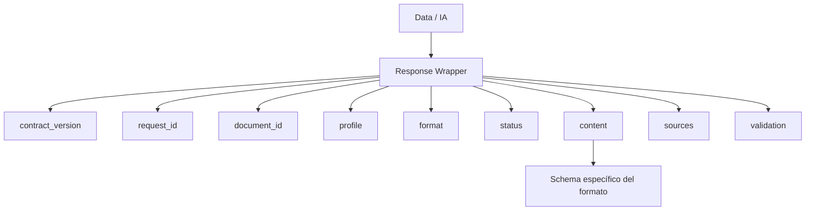
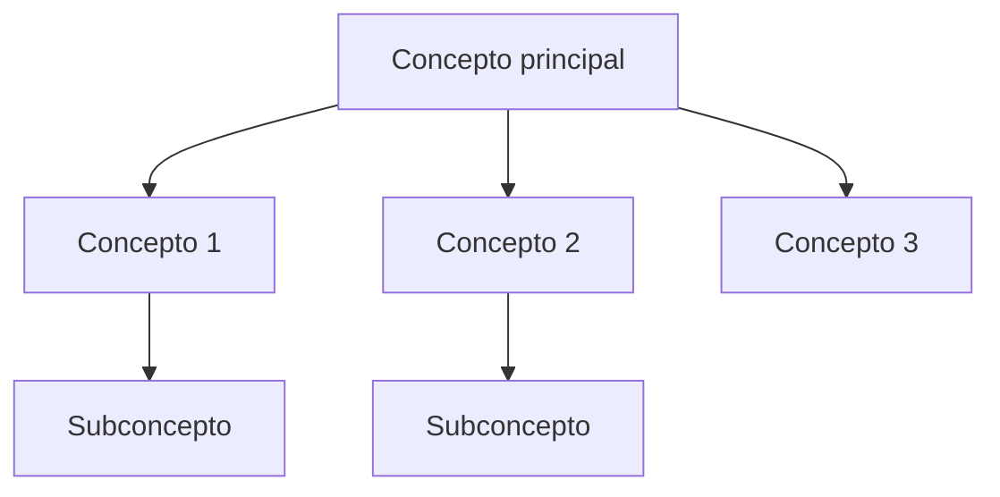
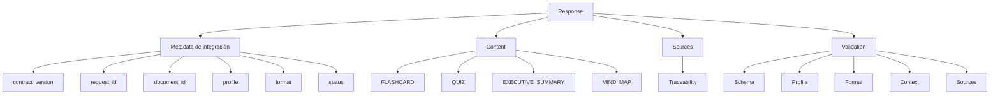

# GAP-02 — Schemas de Salida de los Formatos MVP

**Proyecto:** NuevaMente
**Equipo:** G10-LATAM-EQUIPO15
**Área:** Data / IA + Backend + Frontend
**Tipo:** GAP de arquitectura e integración
**Estado:** 🟡 Decisión propuesta — Pendiente de aprobación
**Prioridad:** 🔴 Alta
**Relacionado con:** Contrato Backend ↔ Data/IA

---

# 1. Objetivo

Definir la estructura de salida que Data/IA debe entregar para cada uno de los cuatro formatos contemplados en el MVP:

* `FLASHCARD`
* `QUIZ`
* `EXECUTIVE_SUMMARY`
* `MIND_MAP`

El objetivo no es definir todavía cómo el modelo genera cada contenido.

El objetivo es establecer un **contrato de salida estable**, que permita que:

```text
Data / IA
    ↓
JSON
    ↓
Backend
    ↓
Frontend
```

puedan trabajar independientemente.

---

# 2. Situación actual

El contrato general ya contempla una respuesta común:

```json
{
  "contract_version": "1.1",
  "request_id": "req_123",
  "document_id": "doc_456",
  "profile": "JUNIOR",
  "format": "FLASHCARD",
  "status": "APPROVED",
  "content": {},
  "sources": [],
  "validation": {}
}
```

El problema pendiente es definir qué debe contener:

```text
content
```

dependiendo del formato solicitado.

Actualmente tenemos los cuatro formatos MVP:

```text
FLASHCARD
QUIZ
EXECUTIVE_SUMMARY
MIND_MAP
```

Por lo tanto:

> El Backend y el Frontend necesitan conocer la estructura de `content`, pero no necesitan conocer cómo Data/IA construye internamente ese contenido.

---

# 3. Principio de diseño

Se propone separar:

```text
CONTRATO EXTERNO
        │
        ├── estructura estable
        ├── tipos definidos
        └── datos necesarios para consumir el resultado

IMPLEMENTACIÓN INTERNA
        │
        ├── prompts
        ├── LLM
        ├── RAG
        ├── retrieval
        ├── embeddings
        └── validación interna
```

La implementación interna puede cambiar sin obligar a modificar Backend o Frontend mientras se mantenga el contrato.

---

# 4. Formatos MVP

Los formatos aprobados actualmente para el MVP son:

| Formato             | Propósito                          |
| ------------------- | ---------------------------------- |
| `FLASHCARD`         | Facilitar repaso mediante tarjetas |
| `QUIZ`              | Facilitar evaluación/práctica      |
| `EXECUTIVE_SUMMARY` | Presentar síntesis ejecutiva       |
| `MIND_MAP`          | Representar conceptos y relaciones |

`STEP_BY_STEP` queda fuera del MVP actual.

---

# 5. Estructura general de respuesta

Todos los formatos compartirán el mismo wrapper:



Esto significa que solamente cambia:

```text
content
```

mientras el resto de la respuesta permanece estable.

---

# 6. Schema común

Propuesta:

```json
{
  "contract_version": "1.1",
  "request_id": "req_123",
  "document_id": "doc_456",
  "profile": "JUNIOR",
  "format": "FLASHCARD",
  "status": "APPROVED",
  "content": {},
  "sources": [],
  "validation": {}
}
```

---

# 7. GAP-02.1 — FLASHCARD

## Objetivo

Representar información de estudio mediante una colección de tarjetas.

La estructura debe permitir al Frontend mostrar:

```text
Pregunta / concepto
        ↓
Respuesta / explicación
```

### Propuesta

```json
{
  "content": {
    "type": "FLASHCARD",
    "title": "Conceptos fundamentales de redes",
    "items": [
      {
        "id": "fc-001",
        "question": "¿Qué es una red virtual?",
        "answer": "Es una red lógica que permite..."
      },
      {
        "id": "fc-002",
        "question": "¿Qué función cumple una subred?",
        "answer": "Permite segmentar..."
      }
    ]
  }
}
```

### Campos

| Campo              | Tipo   | Obligatorio |
| ------------------ | ------ | ----------: |
| `type`             | string |           ✅ |
| `title`            | string |           ✅ |
| `items`            | array  |           ✅ |
| `items[].id`       | string |           ✅ |
| `items[].question` | string |           ✅ |
| `items[].answer`   | string |           ✅ |

### Consideración

No se incluye en el contrato externo información como:

* prompt utilizado;
* embedding;
* similarity;
* chunk;
* ranking de retrieval.

Esos elementos pertenecen a la implementación interna.

---

# 8. GAP-02.2 — QUIZ

## Objetivo

Representar preguntas de evaluación derivadas del contenido disponible.

La estructura debe permitir al Frontend:

* mostrar una pregunta;
* mostrar alternativas;
* identificar la respuesta correcta;
* mostrar una explicación cuando corresponda.

### Propuesta

```json
{
  "content": {
    "type": "QUIZ",
    "title": "Evaluación de conceptos básicos",
    "items": [
      {
        "id": "q-001",
        "question": "¿Cuál es la función principal de una subred?",
        "options": [
          {
            "id": "a",
            "text": "Segmentar una red"
          },
          {
            "id": "b",
            "text": "Eliminar una red"
          },
          {
            "id": "c",
            "text": "Crear un usuario"
          }
        ],
        "correct_option": "a",
        "explanation": "Una subred permite segmentar..."
      }
    ]
  }
}
```

### Campos

| Campo              | Tipo   | Obligatorio |
| ------------------ | ------ | ----------: |
| `type`             | string |           ✅ |
| `title`            | string |           ✅ |
| `items`            | array  |           ✅ |
| `items[].id`       | string |           ✅ |
| `items[].question` | string |           ✅ |
| `items[].options`  | array  |           ✅ |
| `options[].id`     | string |           ✅ |
| `options[].text`   | string |           ✅ |
| `correct_option`   | string |           ✅ |
| `explanation`      | string |          🟡 |

La explicación podría considerarse obligatoria para el MVP si el objetivo pedagógico incluye retroalimentación.

Esto debe ser confirmado por Data/IA + Frontend.

---

# 9. GAP-02.3 — EXECUTIVE_SUMMARY

## Objetivo

Presentar una síntesis estructurada del documento.

La salida no debería ser simplemente un bloque de texto libre si el Frontend necesita presentar diferentes secciones.

### Propuesta

```json
{
  "content": {
    "type": "EXECUTIVE_SUMMARY",
    "title": "Resumen ejecutivo",
    "summary": "El documento presenta...",
    "key_points": [
      "Primer punto relevante",
      "Segundo punto relevante",
      "Tercer punto relevante"
    ],
    "conclusions": [
      "Conclusión principal"
    ]
  }
}
```

### Campos

| Campo         | Tipo   | Obligatorio |
| ------------- | ------ | ----------: |
| `type`        | string |           ✅ |
| `title`       | string |           ✅ |
| `summary`     | string |           ✅ |
| `key_points`  | array  |           ✅ |
| `conclusions` | array  |          🟡 |

La necesidad de `conclusions` debe validarse con el objetivo funcional del formato.

---

# 10. GAP-02.4 — MIND_MAP

Este formato requiere especial cuidado porque no se trata simplemente de texto.

El Frontend necesita una estructura que pueda convertirse en una representación visual.

Por ello se propone un modelo de nodos y relaciones.



### Propuesta

```json
{
  "content": {
    "type": "MIND_MAP",
    "title": "Conceptos principales",
    "root": {
      "id": "node-001",
      "label": "Redes",
      "children": [
        {
          "id": "node-002",
          "label": "Subredes",
          "children": []
        },
        {
          "id": "node-003",
          "label": "Seguridad",
          "children": []
        }
      ]
    }
  }
}
```

Este modelo utiliza una estructura jerárquica.

---

# 11. Alternativa para MIND_MAP

También existe la posibilidad de utilizar nodos y relaciones explícitas:

```json
{
  "content": {
    "type": "MIND_MAP",
    "title": "Conceptos principales",
    "nodes": [
      {
        "id": "n1",
        "label": "Redes"
      },
      {
        "id": "n2",
        "label": "Subredes"
      }
    ],
    "edges": [
      {
        "source": "n1",
        "target": "n2",
        "relationship": "contiene"
      }
    ]
  }
}
```

### Comparación

| Aspecto              | Árbol    | Nodes + Edges      |
| -------------------- | -------- | ------------------ |
| Simplicidad          | Alta     | Media              |
| Implementación FE    | Simple   | Media              |
| Relaciones complejas | Limitado | Alta               |
| MVP                  | Adecuado | Puede ser excesivo |
| Evolución futura     | Media    | Alta               |

### Propuesta MVP

Utilizar **estructura jerárquica tipo árbol** para reducir complejidad.

El modelo `nodes + edges` puede quedar como evolución futura si el producto requiere relaciones no jerárquicas.

---

# 12. Perfil y formato

El schema de contenido no debe contener nuevamente:

```text
profile
format
document_id
request_id
```

porque ya existen en el wrapper.

Por ejemplo, se evita:

```json
{
  "format": "FLASHCARD",
  "content": {
    "format": "FLASHCARD"
  }
}
```

La propuesta es mantener:

```json
{
  "format": "FLASHCARD",
  "content": {
    "type": "FLASHCARD"
  }
}
```

Aunque incluso `content.type` podría considerarse redundante.

La decisión final deberá tomarse entre Backend y Frontend.

---

# 13. Relación con los perfiles

Los perfiles actuales del MVP son:

```text
JUNIOR
SENIOR
EJECUTIVO
```

El perfil **no debería cambiar el schema estructural**.

Debe cambiar principalmente el contenido generado.

Ejemplo:

```text
                    FLASHCARD
                        │
            ┌───────────┼───────────┐
            ▼           ▼           ▼
         JUNIOR       SENIOR     EJECUTIVO
            │           │           │
            ▼           ▼           ▼
       contenido    contenido    contenido
       adaptado     adaptado     adaptado
```

Esto permite mantener un contrato estable.

---

# 14. Fuentes

Las fuentes deben mantenerse fuera de `content`.

Ejemplo:

```json
{
  "content": {
    "type": "FLASHCARD",
    "title": "...",
    "items": []
  },
  "sources": [
    {
      "source_id": "src-001",
      "document_id": "doc-456",
      "reference": "Capítulo 2",
      "page": 12,
      "section": "Subredes"
    }
  ]
}
```

Esto mantiene separadas:

```text
CONTENT
   +
TRACEABILITY
```

El Frontend puede mostrar las fuentes sin que Data/IA tenga que incluirlas dentro de cada elemento generado.

---

# 15. Validación

La validación también permanece fuera de `content`.

Ejemplo:

```json
{
  "status": "APPROVED",
  "validation": {
    "schema_valid": true,
    "profile_valid": true,
    "format_valid": true,
    "context_sufficient": true,
    "sources_traceable": true
  }
}
```

No se propone todavía introducir:

```text
quality_score >= 0.85
```

como regla contractual.

Ese umbral continúa pendiente de decisión y evidencia.

---

# 16. Estructura completa propuesta



---

# 17. Principios del contrato

## 17.1 Contrato estable

Backend y Frontend no deberían depender de la implementación interna de IA.

---

## 17.2 Schema explícito

Cada formato debe tener una estructura conocida.

Evitar:

```json
{
  "content": "texto libre..."
}
```

cuando el Frontend necesita información estructurada.

---

## 17.3 Validación antes de entregar

Data/IA debe verificar que el resultado cumple el schema correspondiente antes de marcarlo como aprobado.

---

## 17.4 Trazabilidad independiente

Las fuentes deben mantenerse en un bloque específico:

```text
sources
```

y no mezclarse con detalles internos del retrieval.

---

## 17.5 Evolución controlada

Los schemas podrán evolucionar mediante:

```text
contract_version
```

sin modificar innecesariamente toda la arquitectura.

---

# 18. Riesgos

## R-01 — Diseñar schemas demasiado complejos

Un schema excesivamente detallado puede:

* aumentar el trabajo de Data/IA;
* aumentar la validación;
* aumentar el trabajo de Frontend;
* retrasar el MVP.

**Mitigación:** mantener schemas mínimos y orientados al consumo.

---

## R-02 — Schema demasiado genérico

Si todos los formatos devuelven texto libre:

```json
{
  "content": "..."
}
```

Frontend tendría que interpretar contenido generado.

**Mitigación:** utilizar estructuras específicas por formato.

---

## R-03 — Acoplamiento con el LLM

No se deben incluir en el contrato:

* prompts;
* modelo utilizado;
* temperatura;
* tokens;
* embeddings;
* chunks;
* similarity;
* retrieval rank.

**Mitigación:** mantener estos elementos internos de Data/IA.

---

## R-04 — Diseñar para funcionalidades futuras

Existe riesgo de incorporar desde el MVP estructuras necesarias solamente para funcionalidades futuras.

**Mitigación:** aplicar el principio:

> Diseñar lo necesario para el MVP, no para todas las posibles versiones futuras.

---

# 19. Criterios para cerrar GAP-02

El GAP estará cerrado cuando:

### General

* [ ] Los cuatro formatos tienen schema definido.
* [ ] Backend conoce la estructura.
* [ ] Frontend conoce la estructura.
* [ ] Data/IA puede generar la estructura.
* [ ] Existe validación del schema.

### FLASHCARD

* [ ] Estructura aprobada.
* [ ] Campos obligatorios definidos.

### QUIZ

* [ ] Estructura aprobada.
* [ ] Alternativas definidas.
* [ ] Respuesta correcta definida.
* [ ] Explicación confirmada.

### EXECUTIVE_SUMMARY

* [ ] Estructura aprobada.
* [ ] Secciones obligatorias definidas.

### MIND_MAP

* [ ] Estructura aprobada.
* [ ] Modelo jerárquico confirmado.
* [ ] Representación compatible con Frontend.

### Integración

* [ ] `content` definido por formato.
* [ ] `sources` definido independientemente.
* [ ] `validation` definido independientemente.
* [ ] No existen detalles internos de IA en el contrato público.

---

# 20. Relación con Issues

| Issue     | Relación                        |
| --------- | ------------------------------- |
| **IA-01** | Define las salidas del pipeline |
| **IA-06** | Generación adaptada a formato   |
| **IA-07** | Validación de la salida         |
| **IA-08** | Integración y JSON              |
| **BE-02** | Contrato de datos               |
| **BE-07** | Integración Backend ↔ Data/IA   |
| **FE**    | Consumo de los cuatro formatos  |

---

# 21. Decisiones pendientes

Antes de marcar este GAP como cerrado, el equipo debe confirmar:

### D-01

¿`content.type` es necesario si `format` ya existe en el wrapper?

### D-02

¿`QUIZ.explanation` es obligatorio?

### D-03

¿`EXECUTIVE_SUMMARY.conclusions` es obligatorio?

### D-04

¿`MIND_MAP` utilizará estructura jerárquica?

### D-05

¿Cuántos elementos mínimos/máximos tendrá cada formato en el MVP?

### D-06

¿Se requiere algún campo adicional específico para el Frontend?

Estas decisiones deben cerrarse con participación de:

```text
Data/IA
Backend
Frontend
```

porque el schema es un contrato entre los tres componentes.

---

# 22. Propuesta de decisión

La propuesta inicial para el MVP es:

```text
FLASHCARD
→ items[]
→ question
→ answer

QUIZ
→ items[]
→ question
→ options[]
→ correct_option
→ explanation

EXECUTIVE_SUMMARY
→ summary
→ key_points[]

MIND_MAP
→ root
→ children[]
```

Manteniendo:

```text
sources
validation
```

fuera de `content`.

---

# 23. Estado

| Campo                      | Estado                     |
| -------------------------- | -------------------------- |
| GAP identificado           | ✅                          |
| Problema definido          | ✅                          |
| Formatos MVP identificados | ✅                          |
| Schema preliminar          | ✅                          |
| Impacto Backend            | ✅                          |
| Impacto Frontend           | ✅                          |
| Impacto Data/IA            | ✅                          |
| Decisión del equipo        | 🟡 Pendiente               |
| Implementación             | ⏳ No iniciar hasta aprobar |
| Contrato definitivo        | ⏳ Pendiente                |

---

# 24. Próximo GAP

Una vez cerrado GAP-02, el siguiente punto recomendado es:

> **GAP-03 — Query Builder**

Este GAP responde una pregunta fundamental de NuevaMente:

> **Si el usuario selecciona un documento, perfil y formato, pero no proporciona una pregunta, ¿cómo decide Data/IA qué información debe recuperar del documento?**

El objetivo será determinar si necesitamos:

```text
Documento
   ↓
Query Builder genérico
   ↓
Queries de recuperación
   ↓
Retriever
```

y hasta qué punto debemos especializar esas consultas según:

```text
FLASHCARD
QUIZ
EXECUTIVE_SUMMARY
MIND_MAP
```

sin introducir complejidad innecesaria en el MVP.

---

# 25. Regla de arquitectura

> **El contrato define qué deben intercambiar los componentes; no define cómo Data/IA produce internamente el resultado.**

Y:

> **Los cuatro formatos deben ser consumibles por Backend y Frontend sin que estos conozcan prompts, RAG, embeddings, retrieval o modelos LLM.**
