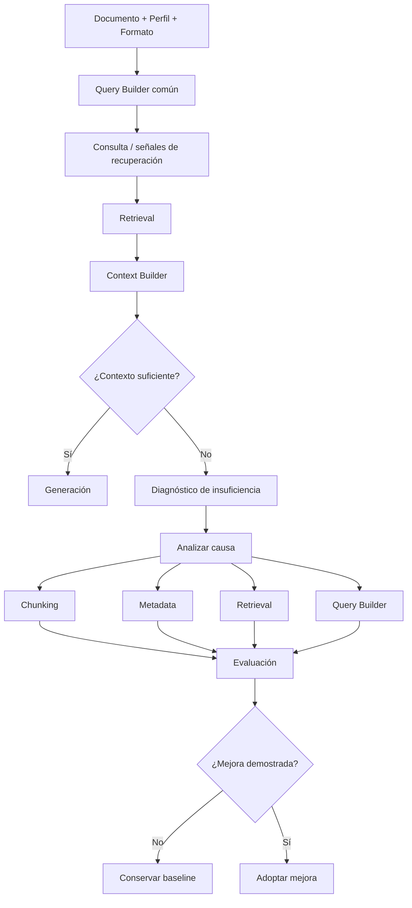
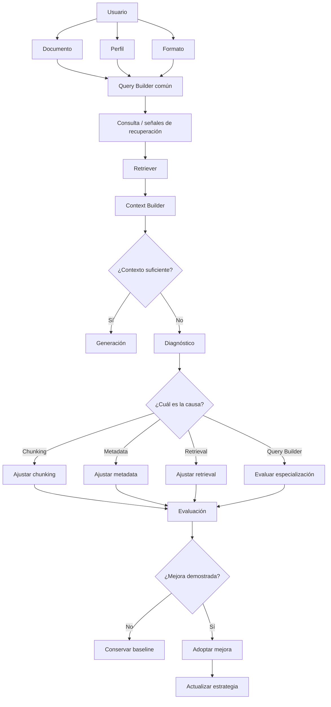
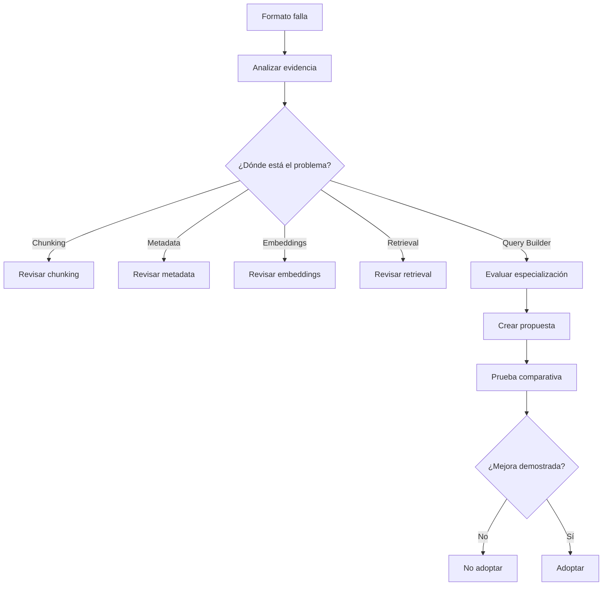
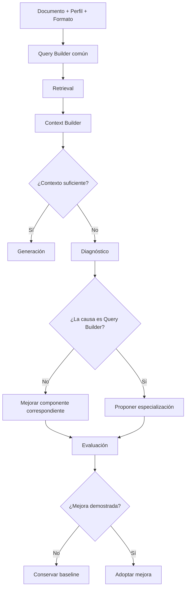

# GAP-03 — Query Builder

**Proyecto:** NuevaMente
**Equipo:** G10-LATAM-EQUIPO15
**Área:** Data / IA
**Relacionado con:** Retrieval / RAG / Generación
**Tipo:** GAP de arquitectura y calidad de recuperación
**Estado:** 🟡 Decisión propuesta — Pendiente de aprobación
**Prioridad:** 🔴 Alta
**Relacionado con:** IA-01, IA-03, IA-04, IA-05, IA-06, IA-07

---

# 1. Objetivo

Definir cómo NuevaMente determina **qué información debe recuperar del documento** cuando el usuario no proporciona una pregunta explícita.

NuevaMente no funciona necesariamente como un chatbot tradicional.

El usuario selecciona principalmente:

```text
Documento
Perfil
Formato
```

Por lo tanto, el sistema necesita transformar esa intención en una estrategia de recuperación que permita obtener el contexto necesario para generar el contenido solicitado.

El objetivo de este GAP es determinar:

* si necesitamos una etapa explícita de Query Builder;
* qué información utiliza;
* qué responsabilidad tiene;
* cómo se relaciona con el Retriever;
* cómo determinar si el contexto recuperado es suficiente;
* cuándo tendría sentido especializar la estrategia por formato;
* cómo evitar introducir complejidad innecesaria en el MVP.

---

# 2. Situación actual

El contrato de entrada contempla:

```json
{
  "document": {
    "document_id": "doc_456",
    "title": "Introducción a Redes en OCI",
    "text": "Texto normalizado del documento..."
  },
  "profile": "JUNIOR",
  "format": "FLASHCARD"
}
```

El usuario puede seleccionar:

```text
Documento:
Introducción a Redes en OCI

Perfil:
JUNIOR

Formato:
FLASHCARD
```

pero no necesariamente proporciona una pregunta como:

```text
"¿Qué es una subred?"
```

Por tanto, Data/IA debe determinar qué información resulta relevante para producir:

```text
FLASHCARD
QUIZ
EXECUTIVE_SUMMARY
MIND_MAP
```

---

# 3. Problema a resolver

Un Retriever tradicional puede recibir una consulta explícita:

```text
"¿Qué es una subred?"
```

Pero NuevaMente puede recibir solamente:

```text
document_id
+
profile
+
format
```

Por lo tanto, necesitamos una estrategia que transforme:

```text
Intención del usuario
        +
Perfil
        +
Formato
        +
Información disponible del documento
```

en señales que permitan recuperar el contexto adecuado.

Conceptualmente:

```text
Documento + Perfil + Formato
              ↓
        Query Builder
              ↓
       Consulta / señales
              ↓
           Retriever
              ↓
           Contexto
              ↓
         Generación
```

---

# 4. ¿Existe realmente un GAP?

Sí.

Sin una estrategia definida existen diferentes posibilidades.

## Opción A — Recuperación general

```text
Documento
   ↓
Embeddings
   ↓
Chunks relevantes
   ↓
Contexto
```

El sistema podría recuperar los fragmentos más representativos del documento.

### Ventaja

Simplicidad.

### Riesgo

La recuperación puede no estar suficientemente orientada al objetivo específico del formato.

---

# 5. Opción B — Query Builder especializado desde el inicio

Cada formato tendría su propia estrategia:

```text
FLASHCARD
    ↓
Query Builder Flashcard

QUIZ
    ↓
Query Builder Quiz

EXECUTIVE_SUMMARY
    ↓
Query Builder Summary

MIND_MAP
    ↓
Query Builder Mind Map
```

### Ventajas

* Permite orientar la recuperación según las necesidades de cada formato.
* Puede producir consultas más específicas.

### Desventajas

* Mayor complejidad.
* Mayor cantidad de reglas.
* Mayor cantidad de pruebas.
* Mayor mantenimiento.
* Riesgo de duplicar lógica.
* No existe todavía evidencia de que los cuatro formatos necesiten estrategias distintas.

### Conclusión

No se propone para el inicio del MVP.

---

# 6. Opción C — Híbrida basada en evidencia

Esta es la opción recomendada.

La idea es comenzar con **un único baseline común** para todos los formatos.



## Principio fundamental

> **Todos los formatos comienzan utilizando la misma estrategia común. La especialización por formato solo se incorpora cuando la evaluación demuestra que el baseline no es suficiente y se identifica al Query Builder como causa del problema.**

---

# 7. La estrategia híbrida NO significa cuatro Query Builders desde el inicio

Esta aclaración es importante.

No proponemos:

```text
Query Builder común
        +
Query Builder Flashcard
        +
Query Builder Quiz
        +
Query Builder Summary
        +
Query Builder Mind Map
```

desde el comienzo.

La propuesta es:

```text
                 MVP
                  │
                  ▼
        Query Builder común
                  │
        ┌─────────┼─────────┐
        ▼         ▼         ▼
    FLASHCARD    QUIZ    SUMMARY ...
        │         │         │
        └─────────┼─────────┘
                  ▼
              Evaluación
                  │
          ¿Existe problema?
             │          │
            NO          SÍ
             │          │
             ▼          ▼
         Mantener    Investigar
         baseline      causa
```

La especialización aparece **solamente como evolución controlada**.

---

# 8. Flujo completo propuesto



---

# 9. Responsabilidad del Query Builder

El Query Builder tiene una responsabilidad concreta:

> **Traducir el objetivo de generación en una o más señales que orienten la recuperación del conocimiento relevante.**

No es responsable de:

* realizar la búsqueda;
* almacenar embeddings;
* seleccionar físicamente los chunks;
* generar el contenido final;
* validar la respuesta final.

Estas responsabilidades pertenecen a otros componentes.

---

# 10. Query Builder vs Retriever

Esta separación debe mantenerse explícita.

```text
Query Builder
       ↓
Determina QUÉ buscar
       ↓
Retriever
       ↓
Ejecuta la recuperación
       ↓
Context Builder
       ↓
Prepara el contexto
```

### Query Builder

Puede determinar:

```text
Objetivo:
identificar conceptos fundamentales
para un perfil JUNIOR
y formato FLASHCARD
```

### Retriever

Ejecuta la estrategia de recuperación utilizando:

* embeddings;
* vector store;
* metadata;
* filtros;
* otros mecanismos definidos por Data/IA.

---

# 11. Entradas del Query Builder

La propuesta inicial contempla:

```text
document_id
+
profile
+
format
+
metadata disponible
```

Conceptualmente:

```json
{
  "document_id": "doc_456",
  "profile": "JUNIOR",
  "format": "FLASHCARD"
}
```

El contenido completo del documento puede estar disponible internamente, pero no significa que deba enviarse nuevamente como parte de cada consulta.

---

# 12. Salida del Query Builder

No se establece todavía que la salida tenga que ser una única cadena de texto.

Puede ser una estructura interna:

```json
{
  "objective": "identificar conceptos fundamentales",
  "profile": "JUNIOR",
  "format": "FLASHCARD"
}
```

o convertirse posteriormente en una consulta textual:

```text
"Conceptos fundamentales de Introducción a Redes en OCI
para un perfil junior."
```

También puede utilizar señales estructuradas:

```text
conceptos
+
metadata
+
filtros
+
similaridad
```

Por ello:

> **El GAP define la responsabilidad del Query Builder, pero no obliga todavía a una implementación concreta.**

---

# 13. Relación con Metadata

La recuperación puede aprovechar la metadata generada durante la ingesta.

Por ejemplo:

```text
Documento
   │
   ├── sección
   ├── concepto
   ├── dificultad
   ├── content_type
   └── fuente
```

La estrategia de recuperación podría combinar:

```text
Consulta semántica
        +
Filtros de metadata
        ↓
Retriever
```

Esto permite evitar que todo dependa exclusivamente de similitud vectorial.

---

# 14. Query Builder y los cuatro formatos

Todos los formatos utilizan inicialmente el mismo Query Builder.

Sin embargo, el objetivo de recuperación puede considerar el formato.

---

## 14.1 FLASHCARD

Entrada:

```json
{
  "profile": "JUNIOR",
  "format": "FLASHCARD"
}
```

Objetivo conceptual:

```text
Identificar conceptos fundamentales,
definiciones y relaciones básicas
adecuadas para el perfil solicitado.
```

La recuperación debería proporcionar evidencia suficiente para generar preguntas y respuestas sustentadas.

---

## 14.2 QUIZ

Entrada:

```json
{
  "profile": "JUNIOR",
  "format": "QUIZ"
}
```

Objetivo conceptual:

```text
Identificar conceptos, definiciones y relaciones
que permitan formular preguntas verificables
a partir del documento.
```

El resultado debe permitir construir preguntas cuyas respuestas estén respaldadas por el documento.

---

## 14.3 EXECUTIVE_SUMMARY

Entrada:

```json
{
  "profile": "EJECUTIVO",
  "format": "EXECUTIVE_SUMMARY"
}
```

Objetivo conceptual:

```text
Identificar los puntos principales,
elementos relevantes y conclusiones
del documento.
```

---

## 14.4 MIND_MAP

Entrada:

```json
{
  "profile": "JUNIOR",
  "format": "MIND_MAP"
}
```

Objetivo conceptual:

```text
Identificar conceptos principales,
subconceptos y relaciones jerárquicas
presentes en el documento.
```

---

# 15. Contexto suficiente

Este concepto es crítico.

No debemos considerar suficiente un contexto únicamente porque:

```text
Retriever encontró 5 chunks.
```

La pregunta correcta es:

> **¿El contexto recuperado contiene evidencia suficiente para generar el formato solicitado sin inventar información?**

---

## Ejemplo — QUIZ

Para considerar suficiente el contexto podríamos necesitar:

```text
✓ conceptos identificables
✓ información suficiente para formular preguntas
✓ respuestas sustentadas
✓ fuentes trazables
```

---

## Ejemplo — MIND_MAP

Podríamos necesitar:

```text
✓ concepto principal
✓ conceptos relacionados
✓ relaciones suficientemente evidenciadas
```

---

## Ejemplo — FLASHCARD

Podríamos necesitar:

```text
✓ conceptos identificables
✓ definiciones o explicaciones
✓ suficiente evidencia para pregunta y respuesta
```

---

## Ejemplo — EXECUTIVE_SUMMARY

Podríamos necesitar:

```text
✓ temas principales
✓ información relevante
✓ evidencia suficiente para la síntesis
```

La definición exacta de estas reglas se profundizará en los GAP relacionados con:

* contexto insuficiente;
* grounding;
* validación.

---

# 16. La especialización no es automática en producción

Esta es una decisión importante.

Si un formato falla:

```text
QUIZ
   ↓
Contexto insuficiente
```

el sistema **no debe crear automáticamente un nuevo Query Builder**.

El proceso correcto es:



La evolución de la arquitectura es una **decisión de ingeniería basada en evidencia**.

---

# 17. Ejemplo completo

Supongamos:

```text
Documento:
"Fundamentos de Redes"

Perfil:
JUNIOR

Formato:
QUIZ
```

### Paso 1 — Query Builder común

```text
Objetivo:
recuperar conceptos y relaciones
que permitan formular preguntas verificables.
```

### Paso 2 — Retrieval

```text
Query
   ↓
Embeddings + metadata
   ↓
Chunks relevantes
```

### Paso 3 — Context Builder

Construye el contexto que será entregado al componente de generación.

### Paso 4 — Evaluación

```text
¿Existe suficiente evidencia?
```

### Caso A — Sí

```text
Contexto suficiente
       ↓
Generación
       ↓
Validación
       ↓
Respuesta
```

### Caso B — No

```text
Contexto insuficiente
       ↓
Diagnóstico
```

Se analiza si el problema está en:

```text
chunking
metadata
embeddings
retrieval
query
```

Solo si la evidencia apunta al Query Builder:

```text
Query Builder especializado para QUIZ
```

se convierte en una propuesta de evolución.

---

# 18. ¿Qué pasa si un formato funciona?

Si:

```text
FLASHCARD
→ baseline funciona
```

se mantiene:

```text
FLASHCARD
→ Query Builder común
```

No se crea una versión especializada.

La regla es:

> **Si el baseline funciona, no se agrega complejidad.**

---

# 19. ¿Qué pasa si un formato falla?

Supongamos:

```text
FLASHCARD → funciona
QUIZ → falla
SUMMARY → funciona
MIND_MAP → funciona
```

No se modifica todo el sistema.

Se investiga únicamente:

```text
QUIZ
```

El análisis puede descubrir que el problema está en:

```text
chunking
```

En ese caso se mejora el chunking.

Si está en:

```text
metadata
```

se mejora metadata.

Si está en:

```text
retrieval
```

se ajusta retrieval.

Y únicamente si el problema está realmente en la consulta:

```text
Query Builder
```

se plantea una estrategia específica para `QUIZ`.

El resultado podría ser:

```text
FLASHCARD
→ Query Builder común

QUIZ
→ Query Builder especializado

EXECUTIVE_SUMMARY
→ Query Builder común

MIND_MAP
→ Query Builder común
```

Esto es una arquitectura híbrida **basada en evidencia**, no una arquitectura con cuatro soluciones desde el inicio.

---

# 20. Criterios para introducir especialización

Antes de crear un Query Builder específico para un formato deben cumplirse estas condiciones:

### Criterio 1 — Existe un problema reproducible

No basta con un caso aislado.

### Criterio 2 — El problema afecta al resultado

Debe afectar la calidad del contexto o de la generación.

### Criterio 3 — Se descartaron causas alternativas razonables

Debe evaluarse:

* chunking;
* metadata;
* embeddings;
* retrieval;
* contexto.

### Criterio 4 — Existe una hipótesis de mejora

Debe existir una explicación de por qué una estrategia especializada resolvería el problema.

### Criterio 5 — Puede medirse

Debe existir una forma de comparar:

```text
Baseline
vs
Estrategia especializada
```

### Criterio 6 — La mejora justifica la complejidad

La mejora debe compensar:

* código adicional;
* pruebas;
* mantenimiento;
* documentación;
* integración.

---

# 21. Estrategia de evaluación

El Query Builder debe evaluarse por su impacto en el resultado final.

No basta con decir:

> "La query parece correcta."

La evaluación debe seguir:

```text
Query
 ↓
Retrieval
 ↓
Contexto
 ↓
Generación
 ↓
Validación
```

La pregunta principal es:

> **¿La estrategia de recuperación proporciona evidencia relevante y suficiente para generar correctamente el formato solicitado?**

---

# 22. Conjunto de evaluación

Para poder tomar decisiones sobre especialización será necesario disponer de casos representativos.

Por ejemplo:

```text
Documento A
Documento B
Documento C
```

y para cada uno:

```text
FLASHCARD
QUIZ
EXECUTIVE_SUMMARY
MIND_MAP
```

Esto permite observar:

```text
Formato
   ↓
Baseline
   ↓
Resultado
   ↓
Problemas
```

y evita tomar decisiones arquitectónicas basadas en impresiones.

---

# 23. Métricas potenciales

No se establece todavía un umbral contractual.

Sin embargo, para evaluación interna pueden considerarse:

* relevancia de los chunks recuperados;
* cobertura de conceptos;
* suficiencia del contexto;
* fidelidad de la generación;
* trazabilidad de fuentes;
* información faltante;
* casos de contenido no sustentado.

Los umbrales deberán definirse posteriormente con evidencia y casos de prueba.

---

# 24. Lo que NO se propone para el MVP

No se propone implementar inicialmente:

### ❌ Query Builder independiente para cada formato

Primero debe demostrarse la necesidad.

### ❌ Múltiples rondas obligatorias de retrieval

No se debe asumir que más consultas producen mejores resultados.

### ❌ Agente autónomo de retrieval

Aumentaría la complejidad del MVP.

### ❌ GraphRAG

No es necesario para demostrar la funcionalidad base.

### ❌ Knowledge Graph obligatorio

Puede evaluarse posteriormente.

### ❌ Reranking avanzado

Debe justificarse mediante evaluación.

### ❌ LLM-as-Judge para decidir consultas

No es necesario para cerrar este GAP.

---

# 25. Relación con Knowledge Core

El Query Builder debe utilizar el conocimiento disponible en el pipeline, pero no necesita conocer detalles internos de almacenamiento.

Conceptualmente:

```text
Ingesta
   ↓
Chunking
   ↓
Metadata
   ↓
Embeddings
   ↓
Knowledge Core
   ↓
Query Builder
   ↓
Retriever
```

El Query Builder orienta la recuperación.

El Knowledge Core continúa siendo un componente interno de Data/IA.

---

# 26. Riesgos

## R-01 — Sobreingeniería

Construir un Query Builder demasiado sofisticado antes de tener evidencia.

**Mitigación:**

Comenzar con una estrategia común.

---

## R-02 — Especialización prematura

Crear cuatro estrategias independientes desde el inicio.

**Mitigación:**

Aplicar la regla:

> Baseline común → evaluación → especialización solo si está justificada.

---

## R-03 — Diagnóstico incorrecto

Asumir que un problema de generación es un problema de Query Builder.

**Mitigación:**

Analizar todo el pipeline antes de modificar la estrategia de consulta.

---

## R-04 — Confundir Query Builder con Retriever

Son responsabilidades diferentes:

```text
Query Builder
→ determina qué buscar

Retriever
→ ejecuta la recuperación
```

---

## R-05 — Dependencia excesiva del LLM

Intentar resolver todo mediante generación de lenguaje.

**Mitigación:**

Utilizar también:

* embeddings;
* metadata;
* filtros;
* estructura documental.

---

## R-06 — Falta de evaluación

Sin un conjunto de casos, no podremos determinar si una modificación realmente mejora el sistema.

**Mitigación:**

Crear casos de evaluación antes de introducir especializaciones.

---

# 27. Criterios para cerrar GAP-03

El GAP estará cerrado cuando el equipo confirme:

## Arquitectura

* [ ] Existe una responsabilidad definida para Query Builder.
* [ ] Se distingue Query Builder de Retriever.
* [ ] Están definidas sus entradas.
* [ ] Está definida su responsabilidad.
* [ ] Está definida conceptualmente su salida.

## MVP

* [ ] Se confirma un Query Builder común.
* [ ] Los cuatro formatos utilizan inicialmente el baseline común.
* [ ] No existen Query Builders independientes desde el inicio.
* [ ] Se define la estrategia inicial de recuperación.

## Evaluación

* [ ] Existe un conjunto de casos representativos.
* [ ] Puede evaluarse la suficiencia del contexto.
* [ ] Se pueden identificar fallos de recuperación.
* [ ] Se puede determinar la causa probable del fallo.

## Evolución

* [ ] Está definida la regla para introducir especialización.
* [ ] La especialización requiere evidencia.
* [ ] La mejora debe compararse contra el baseline.
* [ ] La complejidad adicional debe justificarse.

---

# 28. Relación con Issues

| Issue     | Relación                              |
| --------- | ------------------------------------- |
| **IA-01** | Arquitectura general del flujo        |
| **IA-03** | Metadata utilizada por recuperación   |
| **IA-04** | Embeddings y Vector Store             |
| **IA-05** | Retriever / RAG                       |
| **IA-06** | Generación basada en contexto         |
| **IA-07** | Validación de suficiencia y fidelidad |

---

# 29. Evaluación de propuestas externas

Cualquier propuesta de Query Builder deberá evaluarse con los mismos criterios que el resto de las propuestas de Data/IA.

| Criterio           | Pregunta                                      |
| ------------------ | --------------------------------------------- |
| Problema real      | ¿Qué problema de recuperación resuelve?       |
| Necesidad MVP      | ¿Es indispensable para demostrar el producto? |
| Calidad            | ¿Mejora realmente el contexto recuperado?     |
| Complejidad        | ¿Cuánto código agrega?                        |
| Tiempo             | ¿Cuánto esfuerzo requiere?                    |
| Mantenimiento      | ¿Cuántas reglas nuevas introduce?             |
| Integración        | ¿Modifica contratos existentes?               |
| Evaluación         | ¿Podemos medir si funciona mejor?             |
| Evolución          | ¿Permite especialización posterior?           |
| Alternativa simple | ¿Puede resolverse con el baseline?            |

---

# 30. Decisión propuesta

## Para el MVP

> **ADOPTAR un Query Builder común como responsabilidad del pipeline de Data/IA, utilizando como entradas el documento, perfil, formato y metadata disponible.**

Todos los formatos comenzarán con esta estrategia común.

```text
FLASHCARD
       │
QUIZ   │
       ├──► Query Builder común
SUMMARY│
       │
MIND_MAP
```

## Estrategia de evolución

> **ADOPTAR una estrategia híbrida basada en evidencia.**

La especialización por formato **no se implementará inicialmente**.

Solo se incorporará cuando:

1. exista un problema reproducible;
2. el problema afecte la recuperación o generación;
3. se hayan analizado otras causas;
4. exista una hipótesis de mejora;
5. pueda compararse contra el baseline;
6. la mejora justifique la complejidad adicional.

---

# 31. Decisión visual



---

# 32. Estado

| Campo                        | Estado                           |
| ---------------------------- | -------------------------------- |
| GAP identificado             | ✅                                |
| Problema definido            | ✅                                |
| Alternativas analizadas      | ✅                                |
| Query Builder conceptual     | ✅                                |
| Opción híbrida definida      | ✅                                |
| Baseline común               | ✅                                |
| Especialización por formato  | ⏳ Solo si se demuestra necesaria |
| Criterios de especialización | ✅                                |
| Evaluación empírica          | ⏳ Pendiente                      |
| Decisión del equipo          | 🟡 Pendiente                     |
| Implementación               | ⏳ No iniciar hasta aprobar       |

---

# 33. Próximo GAP

Una vez definido GAP-03, el siguiente punto recomendado es:

> **GAP-04 — Metadata pedagógica mínima**

La pregunta será:

> **¿Qué metadata necesitamos realmente para que el sistema pueda recuperar, adaptar y validar contenido de acuerdo con el perfil y formato, sin convertir la ingesta en un proceso innecesariamente complejo?**

Deberemos clasificar propuestas como:

```text
MVP
Futuro
No necesario
```

Por ejemplo:

```text
conceptos_clave
prerequisitos
difficulty
content_type
summary
preguntas_hipoteticas
relaciones
```

La decisión deberá considerar qué metadata realmente aporta valor al pipeline y cuál simplemente aumenta el costo y complejidad de procesamiento.

---

# 34. Reglas de arquitectura

> **1. Todos los formatos comienzan con el mismo baseline.**

> **2. Si el baseline funciona, se mantiene.**

> **3. Si un formato falla, primero se investiga la causa antes de modificar el Query Builder.**

> **4. La especialización por formato requiere evidencia.**

> **5. La especialización se incorpora solamente si produce una mejora medible.**

> **6. La mejora debe justificar la complejidad adicional.**

> **7. Query Builder y Retriever son responsabilidades diferentes.**

> **8. El Query Builder orienta la recuperación; no se convierte en un agente autónomo de razonamiento.**

> **9. La arquitectura debe evolucionar por evidencia, no por anticipación.**

> **10. No se agrega complejidad simplemente porque técnicamente sea posible.**


---
