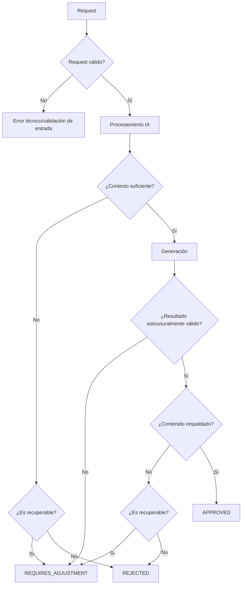

# GAP-07 — Estados de validación y decisión del resultado

**Proyecto:** NuevaMente
**Área:** Data / IA + Backend
**Tipo:** GAP de contrato y comportamiento
**Prioridad:** 🔴 Alta
**Estado:** 🟡 Propuesta — pendiente de aprobación

---

# 1. Objetivo

Definir los estados posibles de un resultado generado por Data/IA y establecer bajo qué condiciones un resultado puede:

* aprobarse;
* requerir ajuste;
* rechazarse;
* considerarse un error técnico.

Este GAP busca evitar que Backend reciba únicamente:

```text
resultado generado
```

sin saber si dicho resultado:

* cumple las reglas;
* tiene suficiente evidencia;
* está correctamente estructurado;
* requiere revisión;
* fue rechazado;
* falló por una causa técnica.

---

# 2. Situación actual

El contrato de integración contempla los estados:

```text
APPROVED
REQUIRES_ADJUSTMENT
REJECTED
```

Además, existen errores técnicos como:

```text
INVALID_REQUEST
INVALID_PROFILE
INVALID_FORMAT
DOCUMENT_INVALID
DOCUMENT_TOO_LARGE
INSUFFICIENT_CONTEXT
PROCESSING_TIMEOUT
INTERNAL_ERROR
SERVICE_UNAVAILABLE
```

Sin embargo, todavía necesitamos definir claramente:

* qué significa cada estado;
* cuándo se utiliza;
* quién lo determina;
* qué información acompaña al estado;
* qué ocurre con `content`;
* qué ocurre con `sources`;
* cómo se diferencia un rechazo funcional de un error técnico.

---

# 3. ¿Existe realmente un GAP?

### Sí.

Los estados ya aparecen en el contrato, pero su semántica todavía necesita una definición operativa.

Sin esta definición podrían ocurrir situaciones como:

```text
Data/IA
   ↓
REJECTED

Backend:
¿por qué?
¿es error?
¿debo reintentar?
¿debo mostrar mensaje?
¿el documento está mal?
¿el contexto es insuficiente?
```

Por tanto:

> **El estado debe comunicar una decisión funcional clara y diferenciada de los errores técnicos.**

---

# 4. Principio de diseño

Se propone separar dos dimensiones:

```text id="g2b1h5"
RESULTADO FUNCIONAL
        +
ESTADO TÉCNICO
```

No todo resultado que no sea `APPROVED` representa un error.

Ejemplo:

```text
Documento válido
      ↓
Retrieval
      ↓
No existe evidencia suficiente
      ↓
REJECTED
```

Esto es un resultado funcional esperado.

En cambio:

```text
Vector Store no disponible
      ↓
SERVICE_UNAVAILABLE
```

es un error técnico.

---

# 5. Estados funcionales

Se mantienen los tres estados definidos en el contrato:

```text id="0yqf7d"
APPROVED
REQUIRES_ADJUSTMENT
REJECTED
```

---

# 6. `APPROVED`

Representa:

> **El resultado fue generado y superó las validaciones requeridas para el MVP.**

Debe cumplir como mínimo:

```text
✓ request válido
✓ perfil válido
✓ formato válido
✓ documento válido
✓ contexto suficiente
✓ contenido generado
✓ estructura válida
✓ fuentes / trazabilidad disponibles
✓ grounding aceptable
```

Flujo:

```text id="2d7k9p"
Contexto suficiente
        ↓
Generación
        ↓
Validación
        ↓
Grounding
        ↓
APPROVED
```

---

# 7. `REQUIRES_ADJUSTMENT`

Representa:

> **Existe un resultado potencialmente recuperable, pero no debe aprobarse todavía.**

Puede utilizarse cuando existe una posibilidad razonable de mejorar el resultado mediante una acción controlada.

Ejemplos:

```text
Contexto parcial
        ↓
REQUIRES_ADJUSTMENT
```

o:

```text
Resultado generado
        ↓
Falla de una validación recuperable
        ↓
REQUIRES_ADJUSTMENT
```

Importante:

> `REQUIRES_ADJUSTMENT` no significa automáticamente que el sistema deba reintentar.

El MVP puede devolver este estado sin implementar todavía un mecanismo automático de regeneración.

---

# 8. `REJECTED`

Representa:

> **El sistema no puede producir un resultado confiable con la información disponible.**

Ejemplos:

```text
Documento válido
       ↓
No existe evidencia suficiente
       ↓
REJECTED
```

o:

```text
Contenido generado
       ↓
Información factual no respaldada
       ↓
REJECTED
```

El rechazo evita enviar al usuario un contenido que el sistema no puede justificar.

---

# 9. Diferencia entre los tres estados

| Estado                | Significado                                    | ¿Se entrega contenido aprobado? |
| --------------------- | ---------------------------------------------- | ------------------------------: |
| `APPROVED`            | Resultado válido                               |                              Sí |
| `REQUIRES_ADJUSTMENT` | Resultado recuperable, requiere acción         |                              No |
| `REJECTED`            | No puede aprobarse con la evidencia disponible |                              No |

La distinción fundamental es:

```text
APPROVED
    ↓
puede utilizarse

REQUIRES_ADJUSTMENT
    ↓
podría recuperarse

REJECTED
    ↓
no puede aprobarse
```

---

# 10. Estados funcionales ≠ errores técnicos

Esta separación es fundamental.

## Resultado funcional

```text
REJECTED
```

significa:

> El procesamiento se ejecutó, pero el resultado no puede aprobarse.

## Error técnico

```text
INTERNAL_ERROR
```

significa:

> El sistema no pudo completar correctamente el procesamiento.

---

# 11. Ejemplos

| Situación                        | Estado                                             |
| -------------------------------- | -------------------------------------------------- |
| Resultado correcto               | `APPROVED`                                         |
| Contexto parcialmente suficiente | `REQUIRES_ADJUSTMENT`                              |
| No existe evidencia suficiente   | `REJECTED`                                         |
| Contenido no respaldado          | `REJECTED`                                         |
| JSON generado incorrectamente    | `REQUIRES_ADJUSTMENT` o rechazo según recuperación |
| Request inválido                 | `INVALID_REQUEST`                                  |
| Perfil desconocido               | `INVALID_PROFILE`                                  |
| Formato desconocido              | `INVALID_FORMAT`                                   |
| Documento inválido               | `DOCUMENT_INVALID`                                 |
| Documento demasiado grande       | `DOCUMENT_TOO_LARGE`                               |
| Timeout                          | `PROCESSING_TIMEOUT`                               |
| Servicio externo no disponible   | `SERVICE_UNAVAILABLE`                              |
| Error inesperado                 | `INTERNAL_ERROR`                                   |

---

# 12. Flujo de decisión



---

# 13. ¿Quién determina el estado?

La decisión funcional debe pertenecer principalmente a **Data/IA**, porque Data/IA conoce:

* contexto;
* retrieval;
* grounding;
* validación de contenido;
* formato;
* perfil;
* reglas de generación.

Backend no necesita conocer los detalles internos.

Conceptualmente:

```text
Backend
   ↓
Request
   ↓
Data/IA
   ↓
Procesamiento
   ↓
Validación
   ↓
Estado
   ↓
Backend
```

---

# 14. Responsabilidad de Backend

Backend debe:

* validar la entrada contractual;
* enviar la solicitud;
* recibir la respuesta;
* interpretar el estado;
* manejar errores técnicos;
* exponer el resultado al Frontend.

Backend **no debe decidir por sí mismo** si una respuesta está suficientemente fundamentada.

---

# 15. Responsabilidad de Data/IA

Data/IA debe:

* evaluar suficiencia;
* generar;
* validar grounding;
* verificar estructura del contenido;
* determinar el estado funcional;
* proporcionar información suficiente para explicar el resultado.

---

# 16. Estructura conceptual de respuesta

El contrato contempla una estructura similar a:

```json
{
  "contract_version": "1.1",
  "request_id": "req_123",
  "document_id": "doc_456",
  "profile": "JUNIOR",
  "format": "FLASHCARD",
  "status": "APPROVED",
  "content": {},
  "sources": [],
  "validation": {}
}
```

La estructura definitiva debe continuar alineada con GAP-02 y GAP-08.

---

# 17. `APPROVED` con contenido

Cuando:

```text
status = APPROVED
```

se espera:

```text
content ≠ null
```

y debe existir información suficiente para:

* presentar el contenido;
* identificar sus fuentes;
* validar su estructura.

Ejemplo conceptual:

```json
{
  "status": "APPROVED",
  "content": {
    "title": "Redes LAN",
    "items": []
  },
  "sources": [],
  "validation": {
    "grounded": true
  }
}
```

---

# 18. `REQUIRES_ADJUSTMENT`

Cuando:

```text
status = REQUIRES_ADJUSTMENT
```

el contenido no debe considerarse aprobado.

Por tanto, para el MVP se propone:

```json
{
  "status": "REQUIRES_ADJUSTMENT",
  "content": null,
  "sources": [],
  "validation": {
    "reason": "INSUFFICIENT_CONTEXT"
  }
}
```

La estructura exacta de `validation` será definida en GAP-08.

---

# 19. `REJECTED`

Cuando:

```text
status = REJECTED
```

se propone:

```json
{
  "status": "REJECTED",
  "content": null,
  "sources": [],
  "validation": {
    "reason": "INSUFFICIENT_CONTEXT"
  }
}
```

La razón específica debe permitir distinguir, cuando corresponda:

```text
INSUFFICIENT_CONTEXT
UNSUPPORTED_CONTENT
VALIDATION_FAILED
```

Los valores definitivos deberán cerrarse en GAP-08.

---

# 20. ¿Puede existir `content` en REJECTED?

### Propuesta: no.

Si un contenido no fue aprobado:

```text
status = REJECTED
```

no debería enviarse como contenido utilizable.

Esto evita que Frontend o Backend interpreten accidentalmente contenido rechazado como válido.

---

# 21. ¿Puede existir `content` en REQUIRES_ADJUSTMENT?

### Propuesta MVP: no.

Aunque internamente Data/IA pueda haber generado contenido parcial, el contrato debe mantener una regla sencilla:

```text
APPROVED
   ↓
content disponible

REQUIRES_ADJUSTMENT
   ↓
content no aprobado

REJECTED
   ↓
content no disponible
```

Esto reduce ambigüedad para Backend y Frontend.

---

# 22. ¿Qué ocurre con `sources`?

Las fuentes deben utilizarse para trazabilidad.

### `APPROVED`

Se espera que existan las fuentes relevantes utilizadas para generar el contenido.

### `REQUIRES_ADJUSTMENT`

Puede existir información de fuentes para diagnóstico, pero no debe interpretarse como evidencia de un resultado aprobado.

### `REJECTED`

Puede incluirse información de diagnóstico si resulta útil, pero no debe presentarse como soporte de un contenido aprobado.

La estructura definitiva debe cerrarse en GAP-08.

---

# 23. Razones de validación

Se propone diferenciar:

```text
status
```

de:

```text
reason
```

Ejemplo:

```json
{
  "status": "REJECTED",
  "validation": {
    "reason": "INSUFFICIENT_CONTEXT"
  }
}
```

Esto es mejor que crear numerosos estados:

```text
REJECTED_INSUFFICIENT_CONTEXT
REJECTED_UNSUPPORTED_CONTENT
REJECTED_INVALID_SCHEMA
...
```

porque mantiene un conjunto pequeño de estados funcionales.

---

# 24. Estado vs razón

La separación propuesta:

```text
status
   ↓
decisión funcional

reason
   ↓
causa de la decisión
```

Ejemplo:

```text
REJECTED
    +
INSUFFICIENT_CONTEXT
```

o:

```text
REQUIRES_ADJUSTMENT
    +
VALIDATION_FAILED
```

---

# 25. ¿Debemos crear más estados?

### No para el MVP.

No se propone introducir estados como:

```text
PARTIAL
WARNING
GENERATING
RETRYING
DEGRADED
```

dentro del contrato funcional principal.

Estos pueden ser útiles internamente, pero aumentarían la superficie del contrato.

---

# 26. Estados internos vs estados públicos

Data/IA puede tener estados internos más detallados:

```text
RETRIEVAL_EMPTY
LOW_RELEVANCE
GROUNDING_FAILED
SCHEMA_ERROR
REGENERATION_REQUIRED
...
```

Pero el contrato público puede mantener:

```text
APPROVED
REQUIRES_ADJUSTMENT
REJECTED
```

acompañados por:

```text
reason
```

Esto mantiene desacoplados:

```text
arquitectura interna
        ≠
contrato de integración
```

---

# 27. Flujo interno vs contrato

```text
                 DATA / IA
┌─────────────────────────────────────┐
│ RETRIEVAL_EMPTY                     │
│ LOW_RELEVANCE                       │
│ GROUNDING_FAILED                    │
│ SCHEMA_ERROR                        │
│ REGENERATION_REQUIRED               │
└──────────────────┬──────────────────┘
                   ↓
          Normalización de estado
                   ↓
┌─────────────────────────────────────┐
│ APPROVED                             │
│ REQUIRES_ADJUSTMENT                 │
│ REJECTED                            │
└──────────────────┬──────────────────┘
                   ↓
                BACKEND
```

---

# 28. Manejo de errores técnicos

Los errores técnicos no deberían convertirse artificialmente en estados funcionales.

Ejemplo:

```text
Vector Store
     ↓
SERVICE UNAVAILABLE
```

No:

```text
REJECTED
```

porque el documento puede contener perfectamente la información requerida.

El problema está en la infraestructura.

---

# 29. ¿Debe Backend reintentar?

Este GAP no define todavía una política completa de retry.

La razón es que el retry está relacionado con:

* timeout;
* disponibilidad;
* idempotencia;
* errores transitorios.

Estos aspectos pertenecen principalmente a los GAP de integración correspondientes.

Por ahora:

> **El estado funcional no implica automáticamente un retry.**

---

# 30. Implementación MVP

La lógica puede conceptualizarse así:

```text
process(request)
    ↓
validate_input()
    ↓
retrieve_context()
    ↓
evaluate_context()
    ↓
if insufficient:
    return status
    ↓
generate()
    ↓
validate_schema()
    ↓
validate_grounding()
    ↓
return final_status
```

Una estructura conceptual podría ser:

```text
ValidationResult
 ├── status
 ├── reason
 ├── sources
 └── details
```

El nombre definitivo dependerá de la implementación de Data/IA.

---

# 31. Reglas MVP

### Regla 1

Solo `APPROVED` representa contenido listo para consumo.

### Regla 2

`REQUIRES_ADJUSTMENT` no significa que el contenido esté aprobado.

### Regla 3

`REJECTED` significa que el resultado no puede aprobarse.

### Regla 4

Los errores técnicos permanecen separados de los estados funcionales.

### Regla 5

`content` no debe enviarse como contenido utilizable cuando el estado no es `APPROVED`.

### Regla 6

`status` representa la decisión.

### Regla 7

`reason` explica la causa.

### Regla 8

Los detalles internos de Data/IA no deben convertirse automáticamente en estados públicos.

---

# 32. Ejemplo completo — APPROVED

```json
{
  "contract_version": "1.1",
  "request_id": "req_001",
  "document_id": "doc_001",
  "profile": "JUNIOR",
  "format": "FLASHCARD",
  "status": "APPROVED",
  "content": {
    "title": "Red LAN",
    "items": []
  },
  "sources": [
    {
      "source_id": "src_001",
      "document_id": "doc_001",
      "reference": "redes.pdf",
      "page": 3
    }
  ],
  "validation": {
    "grounded": true
  }
}
```

---

# 33. Ejemplo completo — REQUIRES_ADJUSTMENT

```json
{
  "contract_version": "1.1",
  "request_id": "req_002",
  "document_id": "doc_001",
  "profile": "JUNIOR",
  "format": "QUIZ",
  "status": "REQUIRES_ADJUSTMENT",
  "content": null,
  "sources": [],
  "validation": {
    "reason": "INSUFFICIENT_CONTEXT"
  }
}
```

---

# 34. Ejemplo completo — REJECTED

```json
{
  "contract_version": "1.1",
  "request_id": "req_003",
  "document_id": "doc_001",
  "profile": "JUNIOR",
  "format": "MIND_MAP",
  "status": "REJECTED",
  "content": null,
  "sources": [],
  "validation": {
    "reason": "UNSUPPORTED_CONTENT"
  }
}
```

---

# 35. Ejemplo — error técnico

```json
{
  "contract_version": "1.1",
  "request_id": "req_004",
  "document_id": "doc_001",
  "profile": "JUNIOR",
  "format": "FLASHCARD",
  "status": "ERROR",
  "content": null,
  "sources": [],
  "validation": {
    "error_code": "SERVICE_UNAVAILABLE"
  }
}
```

> El uso de `ERROR` como estado público debe validarse contra el contrato definitivo. Lo importante en este GAP es mantener separada la categoría de error técnico de los estados funcionales.

---

# 36. Observación importante sobre el contrato

Actualmente el contrato define estados funcionales:

```text
APPROVED
REQUIRES_ADJUSTMENT
REJECTED
```

y errores técnicos mediante códigos.

Por tanto, antes de cerrar este GAP debe decidirse si:

### Alternativa A

El error técnico utiliza:

```text
status = ERROR
error_code = SERVICE_UNAVAILABLE
```

o si:

### Alternativa B

Los errores técnicos se expresan mediante otro mecanismo del contrato.

Esta decisión debe quedar explícita y no asumirse.

---

# 37. Pruebas mínimas

| Caso                                                  | Estado esperado                           |
| ----------------------------------------------------- | ----------------------------------------- |
| Resultado correcto y fundamentado                     | `APPROVED`                                |
| Contexto insuficiente pero potencialmente recuperable | `REQUIRES_ADJUSTMENT`                     |
| Contexto inexistente                                  | `REJECTED`                                |
| Contenido no respaldado                               | `REJECTED`                                |
| Formato inválido                                      | Error de entrada                          |
| Perfil inválido                                       | Error de entrada                          |
| Documento inválido                                    | Error de documento                        |
| Vector Store no disponible                            | Error técnico                             |
| Timeout                                               | Error técnico                             |
| JSON inválido internamente                            | `REQUIRES_ADJUSTMENT` o error según causa |

---

# 38. Riesgos

| Riesgo                                  | Impacto | Mitigación                           |
| --------------------------------------- | ------- | ------------------------------------ |
| Demasiados estados                      | Medio   | Mantener tres estados funcionales    |
| Confusión entre rechazo y error         | Alto    | Separar categorías                   |
| Frontend interpreta contenido rechazado | Alto    | `content = null`                     |
| Backend realiza lógica de IA            | Alto    | Estado decidido por Data/IA          |
| Reasons demasiado específicos           | Medio   | Catálogo controlado                  |
| Cambios frecuentes del contrato         | Alto    | Definir estados antes de integración |
| Retry automático incorrecto             | Medio   | Separar estado de política de retry  |

---

# 39. Relación con otros GAP

```text
GAP-05
Contexto insuficiente
       ↓
¿Recuperable?
       ↓
REQUIRES_ADJUSTMENT / REJECTED

GAP-06
Grounding
       ↓
¿Contenido respaldado?
       ↓
APPROVED / REQUIRES_ADJUSTMENT / REJECTED

GAP-07
Estado final
       ↓
Contrato
       ↓
Backend
```

Y posteriormente:

```text
GAP-08
Schema de validación
```

definirá con mayor precisión la estructura de:

```text
validation
reason
error_code
details
```

---

# 40. Qué NO forma parte del MVP

No se propone:

* crear numerosos estados públicos;
* exponer estados internos del pipeline;
* utilizar `PARTIAL` como estado principal;
* utilizar `WARNING` como estado principal;
* crear estados específicos para cada tipo de fallo;
* hacer que `REQUIRES_ADJUSTMENT` implique retry automático;
* hacer que `REJECTED` implique automáticamente un error técnico;
* enviar contenido no aprobado dentro de `content`.

---

# 41. Decisión propuesta

### 🟡 Propuesta para aprobación

Mantener tres estados funcionales públicos:

```text
APPROVED
REQUIRES_ADJUSTMENT
REJECTED
```

y separar los errores técnicos mediante códigos de error.

Reglas principales:

1. `APPROVED` = contenido listo para consumo.
2. `REQUIRES_ADJUSTMENT` = resultado no aprobado pero potencialmente recuperable.
3. `REJECTED` = resultado que no puede aprobarse con la evidencia disponible.
4. Los errores técnicos no son rechazos funcionales.
5. `content` será `null` cuando el resultado no esté aprobado.
6. `status` expresa la decisión.
7. `reason` explica la causa.
8. Data/IA determina el estado funcional.
9. Backend interpreta el estado y lo expone.
10. Los estados internos no forman parte automáticamente del contrato público.

---

# 42. Criterios para cerrar GAP-07

El GAP podrá considerarse cerrado cuando:

* [ ] Se aprueben los tres estados funcionales.
* [ ] Se defina formalmente `APPROVED`.
* [ ] Se defina formalmente `REQUIRES_ADJUSTMENT`.
* [ ] Se defina formalmente `REJECTED`.
* [ ] Se separe estado funcional de error técnico.
* [ ] Se defina comportamiento de `content`.
* [ ] Se defina comportamiento de `sources`.
* [ ] Se defina estructura inicial de `validation`.
* [ ] Se defina catálogo inicial de `reason`.
* [ ] Se defina tratamiento de errores técnicos.
* [ ] Se determine si existe un estado público `ERROR`.
* [ ] Se creen casos de prueba.
* [ ] Backend y Data/IA validen conjuntamente el comportamiento.

---

# 43. Estado final

**GAP-07 — Estados de validación y decisión del resultado**

**Estado:** 🟡 Propuesta

**Decisión propuesta:**

> Mantener un conjunto pequeño de estados funcionales (`APPROVED`, `REQUIRES_ADJUSTMENT`, `REJECTED`) y separar los errores técnicos mediante códigos específicos. Solo `APPROVED` representa contenido listo para consumo.

**Principio rector:**

> **El estado debe comunicar claramente si el resultado puede utilizarse, si necesita ajuste o si no puede aprobarse; un problema técnico no debe confundirse con una decisión de calidad del contenido.**
