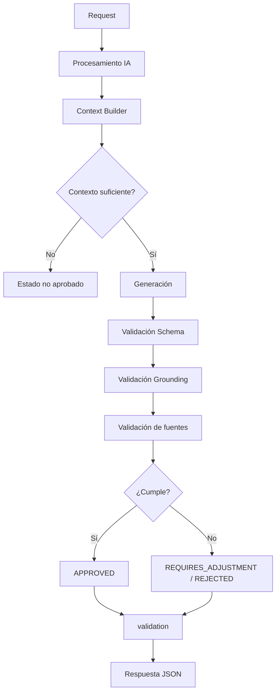

# GAP-08 — Schema de validación

**Proyecto:** NuevaMente  
**Área:** Data / IA + Backend  
**Tipo:** GAP de contrato e integración  
**Prioridad:** 🟠 Importante  
**Estado:** 🟡 Propuesta — pendiente de aprobación

---

# 1. Objetivo

Definir la estructura del objeto:

```json
"validation": {}
```

que forma parte de la respuesta del contrato Data/IA → Backend.

El objetivo es que `validation` permita comunicar, de forma clara y estable:

- si el resultado pasó las validaciones;
- qué aspectos fueron validados;
- si existe algún problema;
- cuál es la razón de un rechazo o ajuste;
- información mínima de trazabilidad de calidad.

Sin exponer detalles internos del pipeline de IA.

---

# 2. Situación actual

El contrato actual contempla una respuesta similar a:

```json
{
  "contract_version": "1.1",
  "request_id": "req_123",
  "document_id": "doc_456",
  "profile": "JUNIOR",
  "format": "FLASHCARD",
  "status": "APPROVED",
  "content": {},
  "sources": [],
  "validation": {}
}
```

GAP-07 estableció que:

```text
APPROVED
REQUIRES_ADJUSTMENT
REJECTED
```

son los estados funcionales principales.

Sin embargo, todavía falta definir qué información debe contener:

```text
validation
```

---

# 3. Problema

Si `validation` queda completamente abierto, cada implementación podría devolver información diferente.

Ejemplo:

```json
{
  "validation": {
    "score": 0.91
  }
}
```

o:

```json
{
  "validation": {
    "grounding": "good",
    "quality": "high"
  }
}
```

o:

```json
{
  "validation": {
    "passed": true,
    "chunks": 5,
    "similarity": 0.87
  }
}
```

Esto generaría un contrato difícil de consumir y mantener.

Necesitamos definir una estructura mínima y estable.

---

# 4. Principio de diseño

La regla propuesta es:

> **`validation` debe comunicar el resultado de las validaciones relevantes para el contrato, no exponer el funcionamiento interno de Data/IA.**

Por lo tanto:

```text
VALIDACIÓN PÚBLICA
        ≠
DETALLES INTERNOS DE IA
```

---

# 5. ¿Existe realmente un GAP?

### Sí.

Necesitamos cerrar:

1. estructura de `validation`;
2. campos obligatorios;
3. campos opcionales;
4. razones de fallo;
5. relación con `status`;
6. relación con `sources`;
7. tratamiento de `quality_score`;
8. información que no debe exponerse.

---

# 6. Qué debe responder `validation`

Idealmente, Backend debería poder responder:

> ¿El contenido pasó las validaciones esperadas?

Y, si no:

> ¿Por qué?

Por ejemplo:

```text
status = APPROVED
```

permite saber que el resultado está aprobado.

Pero:

```text
validation
```

puede proporcionar información complementaria sobre:

- estructura;
- grounding;
- fuentes;
- validaciones ejecutadas.

---

# 7. Separación de responsabilidades

El contrato debe mantener:

```text
status
   ↓
decisión final
```

mientras:

```text
validation
   ↓
información sobre las validaciones
```

Y:

```text
sources
   ↓
trazabilidad de las fuentes
```

Por lo tanto:

```text
status ≠ validation ≠ sources
```

---

# 8. Propuesta de estructura MVP

Se propone una estructura sencilla:

```json
{
  "validation": {
    "validated": true,
    "grounded": true,
    "schema_valid": true
  }
}
```

Para un resultado aprobado.

Esto permite comunicar tres aspectos básicos:

| Campo | Propósito |
|---|---|
| `validated` | Indica que se ejecutó y superó la validación requerida |
| `grounded` | Indica que el contenido está respaldado por el contexto |
| `schema_valid` | Indica que el contenido cumple la estructura esperada |

---

# 9. `validated`

Indica si el resultado pasó las validaciones definidas para el MVP.

Ejemplo:

```json
{
  "validated": true
}
```

### Regla

Para:

```text
APPROVED
```

se espera:

```text
validated = true
```

Para resultados no aprobados, no debe utilizarse `validated = true` como si el contenido estuviera aprobado.

---

# 10. `grounded`

Indica si el contenido generado cumple la validación básica de grounding definida en GAP-06.

Ejemplo:

```json
{
  "validated": true,
  "grounded": true
}
```

Si se detecta contenido no respaldado:

```json
{
  "validated": false,
  "grounded": false
}
```

---

# 11. `schema_valid`

Indica si el contenido generado cumple el schema correspondiente al formato solicitado.

Esto es especialmente importante porque tenemos cuatro formatos:

```text
FLASHCARD
QUIZ
EXECUTIVE_SUMMARY
MIND_MAP
```

Y cada uno tendrá una estructura diferente.

Ejemplo:

```json
{
  "validated": true,
  "grounded": true,
  "schema_valid": true
}
```

---

# 12. Importante: `format` sigue siendo la fuente de verdad

De acuerdo con la decisión tomada en GAP-02:

```text
format
```

determina qué estructura debe tener:

```text
content
```

Por lo tanto, no debemos agregar:

```json
{
  "content": {
    "type": "FLASHCARD"
  }
}
```

La relación correcta es:

```text
format = FLASHCARD
       ↓
content debe cumplir
schema de FLASHCARD
```

Esto evita duplicar información.

---

# 13. Estructura propuesta

### Resultado aprobado

```json
{
  "contract_version": "1.1",
  "request_id": "req_123",
  "document_id": "doc_456",
  "profile": "JUNIOR",
  "format": "FLASHCARD",
  "status": "APPROVED",
  "content": {},
  "sources": [],
  "validation": {
    "validated": true,
    "grounded": true,
    "schema_valid": true
  }
}
```

---

# 14. Resultado rechazado

Ejemplo:

```json
{
  "contract_version": "1.1",
  "request_id": "req_124",
  "document_id": "doc_456",
  "profile": "JUNIOR",
  "format": "QUIZ",
  "status": "REJECTED",
  "content": null,
  "sources": [],
  "validation": {
    "validated": false,
    "grounded": false,
    "schema_valid": false,
    "reason": "INSUFFICIENT_CONTEXT"
  }
}
```

La razón exacta deberá utilizar un catálogo controlado.

---

# 15. `reason`

Se propone incluir:

```text
reason
```

únicamente cuando sea necesario explicar una validación fallida o un estado no aprobado.

Ejemplos iniciales:

```text
INSUFFICIENT_CONTEXT
UNSUPPORTED_CONTENT
VALIDATION_FAILED
SCHEMA_INVALID
```

El catálogo definitivo deberá mantenerse pequeño y estable.

---

# 16. ¿Por qué no crear un campo para cada posible error?

No se propone una estructura como:

```json
{
  "validation": {
    "context_error": false,
    "grounding_error": false,
    "schema_error": false,
    "profile_error": false,
    "format_error": false,
    "retrieval_error": false,
    "embedding_error": false,
    "llm_error": false
  }
}
```

Esto mezclaría:

- validaciones funcionales;
- errores técnicos;
- detalles internos.

Además, obligaría a modificar el contrato cada vez que aparezca un nuevo componente interno.

---

# 17. Errores técnicos

Los errores técnicos deben mantenerse separados.

Por ejemplo:

```text
SERVICE_UNAVAILABLE
PROCESSING_TIMEOUT
INTERNAL_ERROR
```

no deberían convertirse en:

```text
grounded = false
```

porque el problema no necesariamente está relacionado con grounding.

Ejemplo:

```text
Vector Store caído
       ↓
no se pudo recuperar contexto
       ↓
error técnico
```

No significa:

```text
contenido no fundamentado
```

---

# 18. `quality_score`

El contrato original contempla la posibilidad de:

```text
quality_score
```

Sin embargo, siguiendo lo definido en GAP-05 y GAP-06:

> **No se propone convertir `quality_score` en un requisito obligatorio del MVP.**

Tampoco se establece:

```text
quality_score >= 0.85
```

como criterio de aprobación.

---

# 19. ¿Por qué no utilizar el score todavía?

Porque necesitamos demostrar:

1. cómo se calcula;
2. qué representa;
3. si es reproducible;
4. si correlaciona con calidad real;
5. qué diferencias existen entre formatos;
6. qué umbral tendría sentido.

Sin estas pruebas:

```text
0.85
```

sería simplemente un número arbitrario.

---

# 20. Posible evolución futura

En una versión posterior podría existir:

```json
{
  "validation": {
    "validated": true,
    "grounded": true,
    "schema_valid": true,
    "quality_score": 0.93
  }
}
```

pero únicamente si se demuestra que el score aporta información útil para la toma de decisiones.

---

# 21. ¿Debemos exponer métricas internas?

No.

No se propone incluir en el contrato público:

```text
similarity
retrieval_rank
top_k
embedding_score
chunk_count
embedding_id
vector_store_id
prompt_version
model_name
token_count
```

Estos datos pueden ser útiles para:

- debugging;
- observabilidad;
- investigación;
- evaluación.

Pero no son necesarios para que Backend consuma el resultado.

---

# 22. Separación público / interno

```text
                    DATA / IA
                       │
        ┌──────────────┴──────────────┐
        │                             │
        ▼                             ▼
Información interna             Resultado público
        │                             │
        ├── similarity                ├── status
        ├── top_k                     ├── validation
        ├── embeddings                ├── sources
        ├── retrieval_rank            └── content
        ├── model
        └── prompts
```

Esto permite que Data/IA evolucione internamente sin romper el contrato.

---

# 23. `validation` no sustituye `sources`

Es importante mantener ambas estructuras.

### `validation`

Responde:

> ¿El resultado pasó las validaciones?

### `sources`

Responde:

> ¿De dónde proviene la información?

Ejemplo:

```text
validation
   ↓
grounded = true

sources
   ↓
document.pdf
page 15
section "Compute"
```

Ambos cumplen funciones diferentes.

---

# 24. Relación con GAP-06

GAP-06 definió:

```text
Grounding / Fidelidad
```

GAP-08 define cómo comunicar parte de ese resultado:

```text
grounded = true / false
```

Por tanto:

```text
GAP-06
   ↓
validación de grounding
   ↓
GAP-08
   ↓
grounded
```

---

# 25. Relación con GAP-07

GAP-07 define:

```text
APPROVED
REQUIRES_ADJUSTMENT
REJECTED
```

GAP-08 define información complementaria:

```text
validation
```

Por ejemplo:

```text
status = REJECTED

validation:
    validated = false
    grounded = false
    reason = INSUFFICIENT_CONTEXT
```

---

# 26. Relación con GAP-02

GAP-02 define los schemas de:

```text
FLASHCARD
QUIZ
EXECUTIVE_SUMMARY
MIND_MAP
```

GAP-08 debe comprobar que:

```text
content
```

cumpla el schema determinado por:

```text
format
```

Por lo tanto:

```text
format
   ↓
schema de content
   ↓
schema_valid
```

---

# 27. Flujo completo



---

# 28. Implementación MVP

Se propone una estructura interna conceptual:

```text
ValidationResult
├── validated
├── grounded
├── schema_valid
└── reason
```

No necesariamente debe implementarse con una clase con este nombre.

La responsabilidad es lo importante:

```text
Generación
   ↓
Validation Service
   ├── Schema validation
   ├── Grounding validation
   └── Source validation
          ↓
     ValidationResult
          ↓
       Response
```

---

# 29. Reglas para `validation`

### Regla 1

`validation` complementa `status`.

### Regla 2

`validation` no reemplaza `status`.

### Regla 3

`reason` debe utilizar valores controlados.

### Regla 4

Los detalles internos de IA no forman parte del schema público.

### Regla 5

`quality_score` no es obligatorio en MVP.

### Regla 6

`grounded` refleja el resultado de la validación de grounding.

### Regla 7

`schema_valid` refleja el cumplimiento del formato solicitado.

### Regla 8

`format` determina el schema de `content`.

### Regla 9

`content.type` no se utiliza.

### Regla 10

Los errores técnicos se mantienen separados de la validación funcional.

---

# 30. ¿Qué ocurre si una validación falla?

Conceptualmente:

```text
                 Resultado
                     ↓
          ┌──────────┴──────────┐
          │                     │
       Válido                 Inválido
          │                     │
          ▼                     ▼
     APPROVED            ¿Recuperable?
                                │
                         ┌──────┴──────┐
                         │             │
                        Sí             No
                         │             │
                         ▼             ▼
                 REQUIRES_ADJUSTMENT  REJECTED
```

El detalle exacto depende de GAP-07.

---

# 31. Casos de prueba

| Caso | `status` | `validated` | `grounded` | `schema_valid` |
|---|---|---:|---:|---:|
| Resultado correcto | `APPROVED` | `true` | `true` | `true` |
| Grounding insuficiente | `REJECTED` | `false` | `false` | puede ser `true` |
| Schema inválido | `REQUIRES_ADJUSTMENT` / `REJECTED` | `false` | puede ser `true` | `false` |
| Contexto insuficiente | `REQUIRES_ADJUSTMENT` / `REJECTED` | `false` | `false` | `false` |
| Error técnico | Error técnico | No aplica | No aplica | No aplica |

### Nota

En casos donde el procesamiento no llega a ejecutar una validación, no debe inventarse un `false`.

La implementación debe distinguir entre:

```text
false
```

y:

```text
no evaluado
```

si esto resulta necesario en el schema definitivo.

---

# 32. ¿Necesitamos `null`?

Existe una decisión pendiente importante.

Podríamos utilizar:

```json
{
  "grounded": null
}
```

cuando la validación no se ejecutó.

Esto es más semánticamente preciso que:

```json
{
  "grounded": false
}
```

porque:

```text
false
```

significa:

> se evaluó y falló.

Mientras:

```text
null
```

podría significar:

> no fue evaluado.

### Propuesta

Para el MVP:

> Utilizar `null` únicamente si realmente necesitamos distinguir "no evaluado" de "falló".

No agregarlo automáticamente si no existe un caso de uso real.

---

# 33. Catálogo inicial de `reason`

Se propone comenzar con:

```text
INSUFFICIENT_CONTEXT
UNSUPPORTED_CONTENT
VALIDATION_FAILED
SCHEMA_INVALID
```

Podrían agregarse posteriormente otros valores si aparece una necesidad concreta.

No se propone crear:

```text
RETRIEVAL_LOW_SCORE
EMBEDDING_FAILED
PROMPT_FAILED
LLM_HALLUCINATION
```

como razones públicas del contrato.

Son detalles demasiado ligados a la implementación interna.

---

# 34. Observabilidad interna

Aunque esos datos no formen parte del contrato, Data/IA debería poder registrarlos internamente para diagnóstico.

Por ejemplo:

```text
request_id
document_id
retrieval metrics
validation results
model
latency
internal reason
```

Esto permite investigar problemas sin contaminar el contrato.

---

# 35. Ejemplo completo MVP

```json
{
  "contract_version": "1.1",
  "request_id": "req_001",
  "document_id": "doc_001",
  "profile": "JUNIOR",
  "format": "FLASHCARD",
  "status": "APPROVED",
  "content": {
    "title": "Red LAN",
    "items": [
      {
        "question": "¿Qué es una LAN?",
        "answer": "Una red que conecta dispositivos dentro de un área geográfica limitada."
      }
    ]
  },
  "sources": [
    {
      "source_id": "src_001",
      "document_id": "doc_001",
      "reference": "redes.pdf",
      "page": 3,
      "section": "Conceptos básicos"
    }
  ],
  "validation": {
    "validated": true,
    "grounded": true,
    "schema_valid": true
  }
}
```

Observemos que:

```text
format = FLASHCARD
```

y:

```text
content
```

contiene únicamente los datos propios de ese formato.

No existe:

```text
content.type
```

---

# 36. Ejemplo de fallo de grounding

```json
{
  "contract_version": "1.1",
  "request_id": "req_002",
  "document_id": "doc_001",
  "profile": "JUNIOR",
  "format": "FLASHCARD",
  "status": "REJECTED",
  "content": null,
  "sources": [],
  "validation": {
    "validated": false,
    "grounded": false,
    "schema_valid": true,
    "reason": "UNSUPPORTED_CONTENT"
  }
}
```

Aquí:

```text
schema_valid = true
```

puede ser válido porque el problema no fue la estructura del contenido, sino su grounding.

Esto demuestra por qué las validaciones representan dimensiones diferentes.

---

# 37. Ejemplo de schema inválido

```json
{
  "status": "REQUIRES_ADJUSTMENT",
  "content": null,
  "validation": {
    "validated": false,
    "grounded": true,
    "schema_valid": false,
    "reason": "SCHEMA_INVALID"
  }
}
```

El contenido puede estar basado correctamente en el documento, pero no cumplir la estructura requerida por el formato.

---

# 38. Riesgos

| Riesgo | Impacto | Mitigación |
|---|---|---|
| Schema demasiado grande | Medio | Mantener MVP mínimo |
| Exponer detalles internos | Alto | Separar contrato / observabilidad |
| Ambigüedad entre `false` y no evaluado | Medio | Definir semántica |
| Razones demasiado específicas | Medio | Catálogo pequeño |
| `quality_score` sin fundamento | Alto | No hacerlo obligatorio |
| Duplicación con `status` | Medio | Mantener responsabilidades separadas |
| Duplicación de `format` | Alto | No utilizar `content.type` |
| Cambios frecuentes | Alto | Versionar contrato |

---

# 39. Relación con Issues

| Issue | Relación |
|---|---|
| **IA-06** | Generación |
| **IA-07** | Validación de contenido y grounding |
| **IA-08** | Construcción de respuesta JSON |
| **BE-02** | Contrato de integración |
| **BE-07** | Integración E2E |
| **BE-08** | Estabilización final |

---

# 40. Qué NO forma parte del MVP

No se propone inicialmente:

- `quality_score` obligatorio;
- umbral `0.85`;
- LLM-as-Judge;
- múltiples scores complejos;
- métricas de similarity públicas;
- retrieval rank público;
- embeddings públicos;
- IDs del Vector Store;
- nombre del modelo como parte del contrato;
- versión del prompt como parte del contrato;
- estados internos del pipeline;
- `content.type`.

---

# 41. Decisión propuesta

### 🟡 Propuesta para aprobación

Mantener un `validation` pequeño y orientado al contrato:

```json
{
  "validation": {
    "validated": true,
    "grounded": true,
    "schema_valid": true
  }
}
```

y agregar:

```text
reason
```

cuando sea necesario explicar una validación fallida.

Principios:

1. `status` representa la decisión final.
2. `validation` representa las validaciones ejecutadas.
3. `sources` representa trazabilidad.
4. `format` determina el schema de `content`.
5. No existe `content.type`.
6. Los detalles internos permanecen fuera del contrato.
7. `quality_score` no es obligatorio para MVP.
8. Los errores técnicos se mantienen separados.
9. El schema debe permanecer pequeño y estable.
10. La evolución del schema debe realizarse mediante versionado del contrato.

---

# 42. Criterios para cerrar GAP-08

El GAP podrá considerarse cerrado cuando Data/IA y Backend acuerden:

- [ ] Estructura definitiva de `validation`.
- [ ] Definición de `validated`.
- [ ] Definición de `grounded`.
- [ ] Definición de `schema_valid`.
- [ ] Catálogo inicial de `reason`.
- [ ] Tratamiento de `null` / no evaluado.
- [ ] Relación entre `status` y `validation`.
- [ ] Relación entre `validation` y `sources`.
- [ ] Confirmación de que no se utiliza `content.type`.
- [ ] Decisión sobre `quality_score`.
- [ ] Separación de errores técnicos.
- [ ] Casos de prueba.
- [ ] Validación conjunta Data/IA + Backend.
- [ ] Actualización del contrato de integración.

---

# 43. Estado final

**GAP-08 — Schema de validación**

**Estado:** 🟡 Propuesta

**Decisión propuesta:**

> Utilizar un objeto `validation` pequeño, estable y orientado al contrato, compuesto inicialmente por `validated`, `grounded`, `schema_valid` y un `reason` cuando corresponda. Los detalles internos de retrieval, embeddings, modelos y métricas permanecen fuera del contrato público.

**Principio rector:**

> **El contrato debe comunicar lo necesario para consumir y entender el resultado, no revelar cómo funciona internamente la IA.**

### Flujo que queda cerrado hasta ahora

```text
GAP-03
Query Builder
    ↓
GAP-05
Contexto suficiente
    ↓
Generación
    ↓
GAP-06
Grounding / Fidelidad
    ↓
GAP-07
Estado final
    ↓
GAP-08
Schema de validación
    ↓
JSON
    ↓
Backend
```

Con esto, los **GAP-05, GAP-06, GAP-07 y GAP-08** quedan conectados como una única cadena de control de calidad del resultado.
